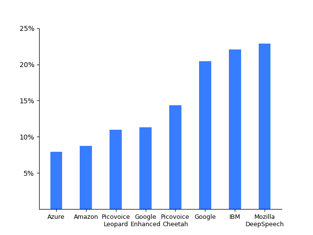

# Speech-to-Text Benchmark

Made in Vancouver, Canada by [Picovoice](https://picovoice.ai)

This repo is a minimalist and extensible framework for benchmarking different speech-to-text engines.

## Table of Contents

- [Data](#data)
- [Metrics](#metrics)
- [Engines](#engines)
- [Usage](#usage)
- [Results](#results)

## Data

- [LibriSpeech](http://www.openslr.org/12/)
- [TED-LIUM](https://www.openslr.org/7/)
- [Common Voice](https://commonvoice.mozilla.org/en)

## Metrics

### Word Error Rate

Word error rate (WER) is the ratio of edit distance between words in a reference transcript and the words in the
output of the speech-to-text engine to the number of words in the reference transcript.

### Real Time Factor

Real-time factor (RTF) is the ratio of CPU (processing) time to the length of the input speech file. A speech-to-text
engine with lower RTF is more computationally efficient. We omit this metric for cloud-based engines.

### Model Size

The aggregate size of models (acoustic and language), in MB. We omit this metric for cloud-based engines.

## Engines

- [Azure Speech-to-Text](https://azure.microsoft.com/en-us/services/cognitive-services/speech-to-text/)
- [Amazon Transcribe](https://aws.amazon.com/transcribe/)
- [Google Speech-to-Text](https://cloud.google.com/speech-to-text)
- [IBM Watson Speech-to-Text](https://www.ibm.com/ca-en/cloud/watson-speech-to-text)
- [Mozilla DeepSpeech](https://github.com/mozilla/DeepSpeech)
- [Picovoice Cheetah](https://picovoice.ai/)
- [Picovoice Leopard](https://picovoice.ai/)

## Usage

This benchmark is developed and test on `Ubuntu 20.04`.

- Install [FFmpeg](https://www.ffmpeg.org/)
- Download datasets.
- Install the requirements:

```console
pip3 install -r requirements.txt
```

### Amazon Transcribe Instructions

Replace `${DATASET}` with one of the supported datasets, `${DATASET_FOLDER}` with path to dataset, and `${AWS_PROFILE}`
with the name of AWS profile you wish to use.

```console
python3 benchmark.py \
--dataset ${DATASET} \
--dataset-folder ${DATASET_FOLDER} \
--engine AMAZON_TRANSCRIBE \
--aws-profile ${AWS_PROFILE}
```

### Azure Speech-to-Text Instructions

Replace `${DATASET}` with one of the supported datasets, `${DATASET_FOLDER}` with path to dataset,
`${AZURE_SPEECH_KEY}` and `${AZURE_SPEECH_LOCATION}` information from your Azure account.

```console
python3 benchmark.py \
--dataset ${DATASET} \
--dataset-folder ${DATASET_FOLDER} \
--engine AZURE_SPEECH_TO_TEXT \
--azure-speech-key ${AZURE_SPEECH_KEY}
--azure-speech-location ${AZURE_SPEECH_LOCATION}
```

### Google Speech-to-Text Instructions

Replace `${DATASET}` with one of the supported datasets, `${DATASET_FOLDER}` with path to dataset, and
`${GOOGLE_APPLICATION_CREDENTIALS}` with credentials download from Google Cloud Platform.

```console
python3 benchmark.py \
--dataset ${DATASET} \
--dataset-folder ${DATASET_FOLDER} \
--engine GOOGLE_SPEECH_TO_TEXT \
--google-application-credentials ${GOOGLE_APPLICATION_CREDENTIALS}
```

### IBM Watson Speech-to-Text Instructions

Replace `${DATASET}` with one of the supported datasets, `${DATASET_FOLDER}` with path to dataset, and
`${GOOGLE_APPLICATION_CREDENTIALS}` with credentials download from Google Cloud Platform.

```console
python3 benchmark.py \
--dataset ${DATASET} \
--dataset-folder ${DATASET_FOLDER} \
--engine GOOGLE_SPEECH_TO_TEXT \
--google-application-credentials ${GOOGLE_APPLICATION_CREDENTIALS}
```

### Mozilla DeepSpeech Instructions

Replace `${DATASET}` with one of the supported datasets, `${DATASET_FOLDER}` with path to dataset,
`${DEEP_SPEECH_MODEL}` with path to DeepSpeech model file (`.pbmm`), and `${DEEP_SPEECH_SCORER}` with path to DeepSpeech
scorer file (`.scorer`).

```console
python3 benchmark.py \
--engine MOZILLA_DEEP_SPEECH \
--dataset ${DATASET} \
--dataset-folder ${DATASET_FOLDER} \
--deepspeech-pbmm ${DEEP_SPEECH_MODEL} \
--deepspeech-scorer ${DEEP_SPEECH_SCORER}
```

### Picovoice Cheetah Instructions

Replace `${DATASET}` with one of the supported datasets, `${DATASET_FOLDER}` with path to dataset, and
`${PICOVOICE_ACCESS_KEY}` with AccessKey obtained from [Picovoice Console](https://console.picovoice.ai/).

```console
python3 benchmark.py \
--engine PICOVOICE_CHEETAH \
--dataset ${DATASET} \
--dataset-folder ${DATASET_FOLDER} \
--picovoice-access-key ${PICOVOICE_ACCESS_KEY}
```

### Picovoice Leopard Instructions

Replace `${DATASET}` with one of the supported datasets, `${DATASET_FOLDER}` with path to dataset, and
`${PICOVOICE_ACCESS_KEY}` with AccessKey obtained from [Picovoice Console](https://console.picovoice.ai/).

```console
python3 benchmark.py \
--engine PICOVOICE_LEOPARD \
--dataset ${DATASET} \
--dataset-folder ${DATASET_FOLDER} \
--picovoice-access-key ${PICOVOICE_ACCESS_KEY}
```

## Results

### Accuracy

| Engine | LibriSpeech test-clean | LibriSpeech test-other |  TED-LIUM | CommonVoice | Average
:---:|:---:|:---:|:---:|:---:|:---:|
Amazon Transcribe | 5.20% | 9.58% | 4.25% | 15.94% | 8.74% |
Azure Speech-to-Text | 4.96% | 9.66% | 4.99% | 12.09% | 7.93% |
Google Speech-to-Text | 11.23% | 24.94% | 15.00% | 30.68% | 20.46% |
Google Speech-to-Text (Enhanced) | 6.62% | 13.59% | 6.68% | 18.39% | 11.32% |
IBM Watson Speech-to-Text | 11.08% | 26.38% | 11.89% | 38.81% | 22.04% |
Mozilla DeepSpeech | 7.27% | 21.45% | 18.90% | 43.82% | 22.86% |
Picovoice Cheetah | 7.08% | 16.28% | 9.11% | 16.66% | 10.68% |
Picovoice Leopard | 5.39% | 12.45% | 9.04% | 17.13% | 11.00% |

| Engine | RTF | Model Size |
:---:|:---:|:---:
Mozilla DeepSpeech | 0.46 | 1142 MB |
Picovoice Cheetah | --- | --- |
Picovoice Leopard | 0.05 | 19 MB |


