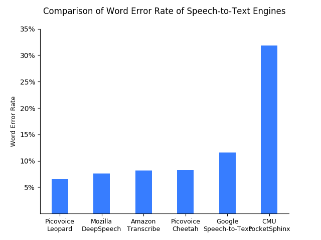
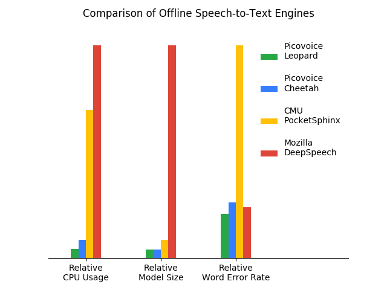

# Speech-to-Text Benchmark

Made in Vancouver, Canada by [Picovoice](https://picovoice.ai)

This repo is a minimalist and extensible framework for benchmarking different speech-to-text engines.

## Table of Contents

- [Data](#data)
- [Metrics](#metrics)
- [Engines](#engines)
  - [Amazon Transcribe](#amazon-transcribe)
  - [Google Speech-to-Text](#google-speech-to-text)
  - [Mozilla DeepSpeech](#mozilla-deepspeech)
  - [Picovoice Cheetah](#picovoice-cheetah)
  - [Picovoice Leopard](#picovoice-leopard)
- [Usage](#usage)
- [Results](#results)

## Data

[LibriSpeech](http://www.openslr.org/12/) dataset is used for benchmarking.

## Metrics

### Word Error Rate

Word error rate (WER) is the ratio of Levenstein distance between words in a reference transcript and the words in the
output of the speech-to-text engine to the number of words in the reference transcript.

### Real Time Factor

Real-time factor (RTF) is the ratio of CPU (processing) time to the length of the input speech file. A speech-to-text
engine with lower RTF is more computationally efficient. We omit this metric for cloud-based engines.

### Model Size

The aggregate size of models (acoustic and language), in MB. We omit this metric for cloud-based engines.

## Engines

### Amazon Transcribe

Amazon Transcribe is a cloud-based speech recognition engine, offered by AWS.

### Google Speech-to-Text

A cloud-based speech recognition engine offered by Google Cloud Platform.

### Mozilla DeepSpeech

[Mozilla DeepSpeech](https://github.com/mozilla/DeepSpeech) is an open-source implementation of
[Baidu's DeepSpeech](https://arxiv.org/abs/1412.5567) by Mozilla. The version used in this benchmark is `0.9.3`.

### Picovoice Cheetah

[Cheetah](https://github.com/Picovoice/cheetah) is a streaming speech-to-text engine developed by
[Picovoice](http://picovoice.ai/). The version used in this benchmark is `1.0.0`

### Picovoice Leopard

[Leopard](https://github.com/Picovoice/leopard) is a speech-to-text engine developed by
[Picovoice](http://picovoice.ai/). The version used in this benchmark is `1.0.1`

## Usage

This benchmark is developed and test on `Ubuntu 20.04`.

Download the [test-clean](http://www.openslr.org/resources/12/test-clean.tar.gz) portion of LibriSpeech and unpack it.
Then, install the requirements:

```console
pip3 install -r requirements.txt
```

### Amazon Transcribe Instructions

Replace `${LIBRI_SPEECH_FOLDER}` with the path to downloaded LibriSpeech dataset and `${AWS_PROFILE}`
with the name of AWS profile you wish to use. 

```console
python3 benchmark.py \
--dataset LIBRI_SPEECH \
--dataset-folder ~/work/data/speech/LibriSpeech/test-clean/ \
--engine AMAZON_TRANSCRIBE \
--aws-profile ${AWS_PROFILE}
```

### Google Speech-to-Text Instructions

Replace `${LIBRI_SPEECH_FOLDER}` with the path to downloaded LibriSpeech dataset and `${GOOGLE_APPLICATION_CREDENTIALS}`
with credentials download from Google Cloud Platform. 

```console
python3 benchmark.py \
--dataset LIBRI_SPEECH \
--dataset-folder ${LIBRI_SPEECH_FOLDER} \
--engine GOOGLE_SPEECH_TO_TEXT \
--google-application-credentials ${GOOGLE_APPLICATION_CREDENTIALS}
```

### Mozilla DeepSpeech Instructions

Replace `${LIBRI_SPEECH_FOLDER}` with the path to downloaded LibriSpeech dataset, `${DEEP_SPEECH_MODEL}` with path to
DeepSpeech model file (`.pbmm`), and `${DEEP_SPEECH_SCORER}` with path to DeepSpeech scorer file (`.scorer`).

```console
python3 benchmark.py \
--engine MOZILLA_DEEP_SPEECH \
--dataset LIBRI_SPEECH \
--dataset-folder ${LIBRI_SPEECH_FOLDER} \
--deepspeech-pbmm ${DEEP_SPEECH_MODEL} \
--deepspeech-scorer ${DEEP_SPEECH_SCORER}
```

### Picovoice Cheetah Instructions

Replace `${LIBRI_SPEECH_FOLDER}` with the path to downloaded LibriSpeech dataset and `${PICOVOICE_ACCESS_KEY}` with
AccessKey obtained from [Picovoice Console](https://console.picovoice.ai/).

```console
python3 benchmark.py \
--engine PICOVOICE_CHEETAH \
--dataset LIBRI_SPEECH \
--dataset-folder ${LIBRI_SPEECH_FOLDER} \
--picovoice-access-key ${PICOVOICE_ACCESS_KEY}
```

### Picovoice Leopard Instructions

Replace `${LIBRI_SPEECH_FOLDER}` with the path to downloaded LibriSpeech dataset and `${PICOVOICE_ACCESS_KEY}` with
AccessKey obtained from [Picovoice Console](https://console.picovoice.ai/).

```console
python3 benchmark.py \
--engine PICOVOICE_LEOPARD \
--dataset LIBRI_SPEECH \
--dataset-folder ${LIBRI_SPEECH_FOLDER} \
--picovoice-access-key ${PICOVOICE_ACCESS_KEY}
```

## Results

The below results are obtained by following the previous steps. The benchmarking was performed on a Linux machine
running Ubuntu 18.04 with 64GB of RAM and an Intel i5-6500 CPU running at 3.2 GHz. WER refers to word error rate and RTF
refers to real time factor.

| Engine | WER (test-clean) | WER (test-other) | RTF | Model Size |
:---:|:---:|:---:|:---:|:---:
Amazon Transcribe | 5.20% | 9.58% | N/A | N/A |
Google Speech-to-Text | 11.23% | 24.94% | N/A | N/A |
Google Speech-to-Text (Enhanced) | 11.23% | 24.94% | N/A | N/A |
Mozilla DeepSpeech | 7.27% | 21.45% | 0.46 | 1142.3 MB |
Picovoice Cheetah | --- | --- | --- | --- |
Picovoice Leopard | 5.73% | 12.84% | **0.05** | 18.2 MB |

The figure below compares the word error rate of speech-to-text engines.



The figure below compares accuracy and runtime metrics of offline speech-to-text engines.


