# Speech-to-Text Benchmark

Made in Vancouver, Canada by [Picovoice](https://picovoice.ai)

This repo is a minimalist and extensible framework for benchmarking different speech-to-text engines.

## Table of Contents

- [Data](#data)
- [Metrics](#metrics)
- [Engines](#engines)
- [Usage](#usage)
- [Results](#results)

## Data

- [LibriSpeech](http://www.openslr.org/12/)
- [TED-LIUM](https://www.openslr.org/7/)
- [Common Voice](https://commonvoice.mozilla.org/en)
- [Multilingual LibriSpeech](https://openslr.org/94)
- [VoxPopuli](https://github.com/facebookresearch/voxpopuli)
- [Fleurs](https://huggingface.co/datasets/google/fleurs) ([Download instructions](script/README.md#dataset-download))
- [JSUT-BASIC](https://huggingface.co/datasets/japanese-asr/ja_asr.jsut_basic5000) ([Download instructions](script/README.md#dataset-download))
- [Zeroth Korean](https://www.openslr.org/40/)
- [Pansori-TEDxKR](https://www.openslr.org/58/)

## Metrics

### Word Error Rate

Word error rate (WER) is the ratio of edit distance between words in a reference transcript and the words in the output
of the speech-to-text engine to the number of words in the reference transcript.

### Character Error Rate

Character error rate (CER) is the ratio of edit distance between characters in a reference transcript and the characters in the output of the speech-to-text engine to the number of characters in the reference transcript. CER is reported for Korean and Japanese following industry standards.

### Punctuation Error Rate

Punctuation Error Rate (PER) is the ratio of punctuation-specific errors between a reference transcript and the output of a speech-to-text engine to the number of punctuation-related operations in the reference transcript (more details in Section 3 of [Meister et al.](https://arxiv.org/abs/2310.02943)). We report PER results for periods (.) and question marks (?).

### Core-Hour

The Core-Hour metric is used to evaluate the computational efficiency of the speech-to-text engine,
indicating the number of CPU hours required to process one hour of audio. A speech-to-text
engine with lower Core-Hour is more computationally efficient. We omit this metric for cloud-based engines.

### Word Emission Latency

Word emission latency is used to evaluate the responsiveness of streaming speech-to-text engines.
It measures the average delay from the point a word has finished being spoken to when its transcription is emitted by the engine.
We measure this metric only for streaming engines.

### Model Size

The aggregate size of models (acoustic and language), in MB. We omit this metric for cloud-based engines.

## Engines

- [Amazon Transcribe](https://aws.amazon.com/transcribe/)
- [Azure Speech-to-Text](https://azure.microsoft.com/en-us/services/cognitive-services/speech-to-text/)
- [Google Speech-to-Text](https://cloud.google.com/speech-to-text)
- [IBM Watson Speech-to-Text](https://www.ibm.com/ca-en/cloud/watson-speech-to-text)
- [Moonshine](https://github.com/usefulsensors/moonshine)
- [Nemotron 3.5 ASR Streaming](https://huggingface.co/nvidia/nemotron-3.5-asr-streaming-0.6b)
- [OpenAI Whisper](https://github.com/openai/whisper)
- [Vosk](https://alphacephei.com/vosk/)
- [Whisper.cpp](https://github.com/ggerganov/whisper.cpp)
- [Picovoice Cheetah](https://picovoice.ai/)
- [Picovoice Leopard](https://picovoice.ai/)

## Usage

This benchmark has been developed and tested on `Ubuntu 22.04` with Python 3.12.

- Install [FFmpeg](https://www.ffmpeg.org/)
- Download datasets.
- Install the requirements:

```console
pip3 install -r requirements.txt
```


### Benchmark Usage

In the following, we provide instructions for running the benchmark for each engine.
The supported datasets are:
`COMMON_VOICE`, `LIBRI_SPEECH_TEST_CLEAN`, `LIBRI_SPEECH_TEST_OTHER`, `TED_LIUM`, `MLS`, `VOX_POPULI`, `FLEURS`, `ZEROTH_KOREAN`, `PANSORI` and `JSUT_BASIC`.
The supported languages are:
`EN`, `FR`, `DE`, `ES`, `IT`, `PT_BR`, `PT_PT`, `KO` and `JA`.

To evaluate Punctuation Error Rate, use the `--punctuation` flag.
Use `--punctuation-set ${PUNCTUATION_SET}` to select which punctuation marks to calculate PER against, where `${PUNCTUATION_SET}` is one or more of `.`, `?` and `,` (default `.?`).

#### Amazon Transcribe Instructions

Replace `${DATASET}` with one of the supported datasets, `${DATASET_FOLDER}` with the path to the dataset, `${LANGUAGE}` with the target language,
`${AWS_LOCATION}` with the name of the AWS server and `${AWS_PROFILE}` with the name of the AWS profile you wish to use.

```console
python3 benchmark.py \
--dataset ${DATASET} \
--dataset-folder ${DATASET_FOLDER} \
--language ${LANGUAGE} \
--engine AMAZON_TRANSCRIBE \
--aws-profile ${AWS_PROFILE} \
--aws-location ${AWS_LOCATION}
```

Set `--engine` to `AMAZON_TRANSCRIBE_STREAMING` to use Amazon Transcribe in streaming mode.

#### Azure Speech-to-Text Instructions

Replace `${DATASET}` with one of the supported datasets, `${DATASET_FOLDER}` with the path to the dataset, `${LANGUAGE}` with the target language,
`${AZURE_SPEECH_KEY}` and `${AZURE_SPEECH_LOCATION}` information from your Azure account.

```console
python3 benchmark.py \
--dataset ${DATASET} \
--dataset-folder ${DATASET_FOLDER} \
--language ${LANGUAGE} \
--engine AZURE_SPEECH_TO_TEXT \
--azure-speech-key ${AZURE_SPEECH_KEY}
--azure-speech-location ${AZURE_SPEECH_LOCATION}
```

Set `--engine` to `AZURE_SPEECH_TO_TEXT_REAL_TIME` to use Azure Speech-to-text in streaming mode.

#### Google Speech-to-Text Instructions

Replace `${DATASET}` with one of the supported datasets, `${DATASET_FOLDER}` with the path to the dataset, `${LANGUAGE}` with the target language
and `${GOOGLE_APPLICATION_CREDENTIALS}` with credentials download from Google Cloud Platform.

```console
python3 benchmark.py \
--dataset ${DATASET} \
--dataset-folder ${DATASET_FOLDER} \
--language ${LANGUAGE} \
--engine GOOGLE_SPEECH_TO_TEXT \
--google-application-credentials ${GOOGLE_APPLICATION_CREDENTIALS}
```

Set `--engine` to `GOOGLE_SPEECH_TO_TEXT_STREAMING` to use Google Speech-to-text in streaming mode.

#### IBM Watson Speech-to-Text Instructions

Replace `${DATASET}` with one of the supported datasets, `${DATASET_FOLDER}` with the path to the dataset
and `${WATSON_SPEECH_TO_TEXT_API_KEY}`/`${${WATSON_SPEECH_TO_TEXT_URL}}` with credentials from your IBM account.
This engine only supports English.

```console
python3 benchmark.py \
--dataset ${DATASET} \
--dataset-folder ${DATASET_FOLDER} \
--language EN \
--engine IBM_WATSON_SPEECH_TO_TEXT \
--watson-speech-to-text-api-key ${WATSON_SPEECH_TO_TEXT_API_KEY}
--watson-speech-to-text-url ${WATSON_SPEECH_TO_TEXT_URL}
```

#### OpenAI Whisper Instructions

Replace `${DATASET}` with one of the supported datasets, `${DATASET_FOLDER}` with the path to the dataset, `${LANGUAGE}` with the target language
and `${WHISPER_MODEL}` with the whisper model type (`WHISPER_TINY`, `WHISPER_BASE`, `WHISPER_SMALL`,
`WHISPER_MEDIUM`, `WHISPER_LARGE_V1`, `WHISPER_LARGE_V2`, `WHISPER_LARGE_V3` or `WHISPER_LARGE_TURBO`)

```console
python3 benchmark.py \
--engine ${WHISPER_MODEL} \
--dataset ${DATASET} \
--language ${LANGUAGE} \
--dataset-folder ${DATASET_FOLDER} \
```

#### Whisper.cpp Streaming Instructions

Replace `${DATASET}` with one of the supported datasets, `${DATASET_FOLDER}` with the path to the dataset, `${LANGUAGE}` with the target language,
and `${WHISPER_CPP_MODEL}` with the Whisper.cpp streaming model type (`WHISPER_CPP_STREAMING_TINY`, `WHISPER_CPP_STREAMING_BASE`, `WHISPER_CPP_STREAMING_SMALL`,
`WHISPER_CPP_STREAMING_MEDIUM`, `WHISPER_CPP_STREAMING_LARGE_V3` or `WHISPER_CPP_STREAMING_LARGE_TURBO`).

```console
python3 benchmark.py \
--engine ${WHISPER_CPP_MODEL} \
--dataset ${DATASET} \
--dataset-folder ${DATASET_FOLDER}
--language ${LANGUAGE} \
```

#### Moonshine Streaming Instructions

Replace `${DATASET}` with one of the supported datasets, `${DATASET_FOLDER}` with the path to the dataset
and `${MOONSHINE_MODEL}` with the Moonshine streaming model type (`MOONSHINE_STREAMING_TINY`, `MOONSHINE_STREAMING_SMALL` or `MOONSHINE_STREAMING_MEDIUM`).
This engine only supports English.

```console
python3 benchmark.py \
--engine ${MOONSHINE_MODEL} \
--dataset ${DATASET} \
--dataset-folder ${DATASET_FOLDER}
--language EN \
```

#### Vosk Streaming Instructions

Replace `${DATASET}` with one of the supported datasets, `${DATASET_FOLDER}` with the path to the dataset
and `${VOSK_MODEL}` with the Vosk streaming model type (`VOSK_STREAMING_SMALL` or `VOSK_STREAMING_LARGE`).
This engine only supports English.

```console
python3 benchmark.py \
--engine ${VOSK_MODEL} \
--dataset ${DATASET} \
--dataset-folder ${DATASET_FOLDER} \
--language EN
```

#### Nemotron 3.5 ASR Streaming Instructions

Replace `${DATASET}` with one of the supported datasets, `${DATASET_FOLDER}` with the path to the dataset, `${LANGUAGE}` with the target language,
and `${CHUNK_SIZE_MS}` with a supported chunk size: 80, 160, 320, 560 or 1120 (default 560).

```console
python3 benchmark.py \
--engine NEMOTRON_3_5_ASR_STREAMING \
--dataset ${DATASET} \
--dataset-folder ${DATASET_FOLDER} \
--language ${LANGUAGE} \
--streaming-chunk-size-ms ${CHUNK_SIZE_MS}
```

#### Picovoice Cheetah Instructions

Replace `${DATASET}` with one of the supported datasets, `${DATASET_FOLDER}` with the path to the dataset, `${LANGUAGE}` with the target language,
and `${PICOVOICE_ACCESS_KEY}` with AccessKey obtained from [Picovoice Console](https://console.picovoice.ai/).
By default, the Cheetah English model is used.
For non-English languages models replace `${PICOVOICE_MODEL_PATH}` with the path to a model file acquired from the [Cheetah Github Repo](https://github.com/Picovoice/cheetah/tree/master/lib/common/).

```console
python3 benchmark.py \
--engine PICOVOICE_CHEETAH \
--dataset ${DATASET} \
--dataset-folder ${DATASET_FOLDER} \
--language ${LANGUAGE} \
--picovoice-access-key ${PICOVOICE_ACCESS_KEY} \
--picovoice-model-path ${PICOVOICE_MODEL_PATH}
```

#### Picovoice Leopard Instructions

Replace `${DATASET}` with one of the supported datasets, `${DATASET_FOLDER}` with the path to the dataset, `${LANGUAGE}` with the target language,
and `${PICOVOICE_ACCESS_KEY}` with AccessKey obtained from [Picovoice Console](https://console.picovoice.ai/).
If benchmarking a non-English language, include `--picovoice-model-path` and replace `${PICOVOICE_MODEL_PATH}` with the path to a model file acquired from the [Leopard Github Repo](https://github.com/Picovoice/leopard/tree/master/lib/common/).

```console
python3 benchmark.py \
--engine PICOVOICE_LEOPARD \
--dataset ${DATASET} \
--dataset-folder ${DATASET_FOLDER} \
--language ${LANGUAGE} \
--picovoice-access-key ${PICOVOICE_ACCESS_KEY} \
--picovoice-model-path ${PICOVOICE_MODEL_PATH}
```

### Latency Benchmark Usage

In the following, we provide instructions for running the latency benchmark for each streaming engine.
To run the benchmark, generate word timing alignment information for one of the supported datasets by following the instructions found [here](script/README.md#alignment-generation).
Replace `${DATASET_PATH}` with the path to the outputted folder from this process in the following commands.

#### Amazon Transcribe Instructions

Replace `${DATASET_FOLDER}` with the path to an aligned dataset, `${LANGUAGE}` with the target language,
`${AWS_LOCATION}` with the name of the AWS server and `${AWS_PROFILE}` with the name of the AWS profile you wish to use.

```console
python3 benchmark_latency.py \
--engine AMAZON_TRANSCRIBE_STREAMING \
--dataset-folder ${DATASET_FOLDER} \
--language ${LANGUAGE} \
--aws-profile ${AWS_PROFILE} \
--aws-location ${AWS_LOCATION}
```

#### Azure Speech-to-Text Instructions

Replace `${DATASET_FOLDER}` with the path to an aligned dataset, `${LANGUAGE}` with the target language,
`${AZURE_SPEECH_KEY}` and `${AZURE_SPEECH_LOCATION}` information from your Azure account.

```console
python3 benchmark_latency.py \
--engine AZURE_SPEECH_TO_TEXT_REAL_TIME \
--dataset-folder ${DATASET_FOLDER} \
--language ${LANGUAGE} \
--azure-speech-key ${AZURE_SPEECH_KEY}
--azure-speech-location ${AZURE_SPEECH_LOCATION}
```

#### Google Speech-to-Text Instructions

Replace `${DATASET_FOLDER}` with the path to an aligned dataset, `${LANGUAGE}` with the target language,
and `${GOOGLE_APPLICATION_CREDENTIALS}` with credentials download from Google Cloud Platform.

```console
python3 benchmark_latency.py \
--engine GOOGLE_SPEECH_TO_TEXT_STREAMING \
--dataset-folder ${DATASET_FOLDER} \
--language ${LANGUAGE} \
--google-application-credentials ${GOOGLE_APPLICATION_CREDENTIALS}
```

#### Whisper.cpp Streaming Instructions

Replace `${DATASET_FOLDER}` with the path to an aligned dataset, `${LANGUAGE}` with the target language,
and `${WHISPER_CPP_MODEL}` with the Whisper.cpp streaming model type (`WHISPER_CPP_STREAMING_TINY`, `WHISPER_CPP_STREAMING_BASE`, `WHISPER_CPP_STREAMING_SMALL`,
`WHISPER_CPP_STREAMING_MEDIUM`, `WHISPER_CPP_STREAMING_LARGE_V3` or `WHISPER_CPP_STREAMING_LARGE_TURBO`).

```console
python3 benchmark_latency.py \
--engine ${WHISPER_CPP_MODEL} \
--dataset-folder ${DATASET_FOLDER} \
--language ${LANGUAGE}
```

#### Moonshine Streaming Instructions

Replace `${DATASET_FOLDER}` with the path to an aligned dataset and `${MOONSHINE_MODEL}` with the Moonshine streaming model type (`MOONSHINE_STREAMING_TINY`, `MOONSHINE_STREAMING_SMALL` or `MOONSHINE_STREAMING_MEDIUM`).
This engine only supports English.

```console
python3 benchmark_latency.py \
--engine ${MOONSHINE_MODEL} \
--dataset-folder ${DATASET_FOLDER} \
--language EN
```

#### Vosk Streaming Instructions

Replace `${DATASET_FOLDER}` with the path to an aligned dataset
and `${VOSK_MODEL}` with the Vosk streaming model type (`VOSK_STREAMING_SMALL` or `VOSK_STREAMING_LARGE`).
This engine only supports English.

```console
python3 benchmark_latency.py \
--engine ${VOSK_MODEL} \
--dataset-folder ${DATASET_FOLDER} \
--language EN
```

#### Nemotron 3.5 ASR Streaming Instructions

Replace `${DATASET_FOLDER}` with the path to an aligned dataset, `${LANGUAGE}` with the target language,
and `${CHUNK_SIZE_MS}` with a supported chunk size: 80, 160, 320, 560 or 1120 (default 560).

```console
python3 benchmark_latency.py \
--engine NEMOTRON_3_5_ASR_STREAMING \
--dataset-folder ${DATASET_FOLDER} \
--language ${LANGUAGE} \
--chunk-size-ms ${CHUNK_SIZE_MS}
```

#### Picovoice Cheetah Instructions

Replace `${DATASET_FOLDER}` with the path to an aligned dataset, `${LANGUAGE}` with the target language,
and `${PICOVOICE_ACCESS_KEY}` with an AccessKey obtained from [Picovoice Console](https://console.picovoice.ai/).
By default, the Cheetah English model is used.
For non-English languages models replace `${PICOVOICE_MODEL_PATH}` with the path to a model file obtained from the [Cheetah Github Repo](https://github.com/Picovoice/cheetah/tree/master/lib/common/).

```console
python3 benchmark_latency.py \
--engine PICOVOICE_CHEETAH \
--dataset-folder ${DATASET_FOLDER} \
--language ${LANGUAGE} \
--picovoice-access-key ${PICOVOICE_ACCESS_KEY} \
--picovoice-model-path ${PICOVOICE_MODEL_PATH}
```

## Results

### English

#### Batch Engines Word Error Rate

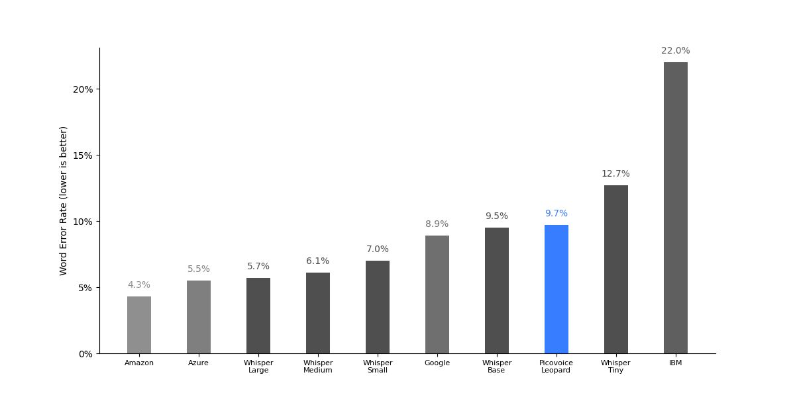

|             Engine             | LibriSpeech test-clean | LibriSpeech test-other | TED-LIUM | CommonVoice | Average |
|:------------------------------:|:----------------------:|:----------------------:|:--------:|:-----------:|:-------:|
|       Amazon Transcribe        |          2.3%          |          4.6%          |   4.0%   |    6.4%     |  4.3%   |
|      Azure Speech-to-Text      |          2.9%          |          6.0%          |   4.6%   |    8.4%     |  5.5%   |
|     Google Speech-to-Text      |          5.3%          |         10.5%          |   5.5%   |    14.3%    |  8.9%   |
|   IBM Watson Speech-to-Text    |         10.9%          |         26.2%          |  11.7%   |    39.4%    |  22.0%  |
|        Whisper Large V3        |          3.7%          |          5.4%          |   4.6%   |    9.0%     |  5.7%   |
|         Whisper Medium         |          3.3%          |          6.2%          |   4.6%   |    10.2%    |  6.1%   |
|         Whisper Small          |          3.3%          |          7.2%          |   4.8%   |    12.7%    |  7.0%   |
|          Whisper Base          |          4.3%          |         10.4%          |   5.4%   |    17.9%    |  9.5%   |
|          Whisper Tiny          |          5.9%          |         13.8%          |   6.6%   |    24.4%    |  12.7%  |
|       Picovoice Leopard        |          5.1%          |         11.1%          |   6.4%   |    16.1%    |  9.7%   |


#### Streaming Engines Word Error Rate

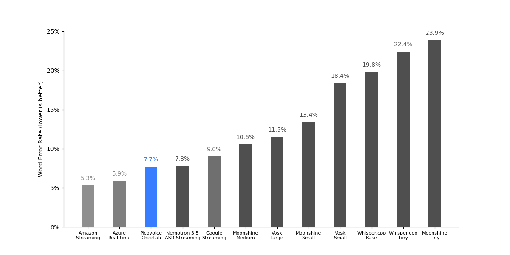

|             Engine             | LibriSpeech test-clean | LibriSpeech test-other | TED-LIUM | CommonVoice | Average |
|:------------------------------:|:----------------------:|:----------------------:|:--------:|:-----------:|:-------:|
|   Amazon Transcribe Streaming  |          2.5%          |          5.1%          |   5.2%   |    8.2%     |  5.3%   |
|  Azure Speech-to-Text Real Time|          3.4%          |          6.7%          |   4.5%   |    9.0%     |  5.9%   |
| Google Speech-to-Text Streaming|          5.3%          |         10.6%          |   5.5%   |    14.4%    |  9.0%   |
|   Nemotron 3.5 ASR Streaming   |          3.4%          |          7.8%          |   4.9%   |    15.0%    |  7.8%   |
|    Whisper.cpp Streaming Tiny  |         12.7%          |         23.3%          |  16.0%   |    37.5%    |  22.4%  |
|    Whisper.cpp Streaming Base  |         11.9%          |         19.9%          |  14.2%   |    33.2%    |  19.8%  |
|          Vosk Small            |          9.9%          |         21.0%          |  10.7%   |    32.1%    |  18.4%  |
|          Vosk Large            |          5.4%          |         12.7%          |   6.6%   |    21.4%    |  11.5%  |
|        Moonshine Tiny          |         11.8%          |         28.7%          |  12.5%   |    42.4%    |  23.9%  |
|        Moonshine Small         |          7.0%          |         15.0%          |   6.9%   |    24.8%    |  13.4%  |
|       Moonshine Medium         |          5.9%          |         11.4%          |   6.5%   |    18.7%    |  10.6%  |
|       Picovoice Cheetah        |          3.3%          |          7.9%          |   5.1%   |    14.4%    |  7.7%   |

#### Streaming Engines Punctuation Error Rate

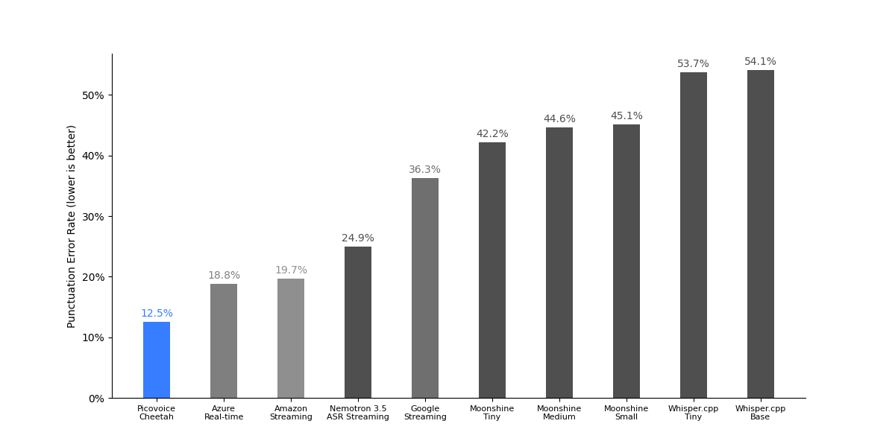

|             Engine              | CommonVoice | Fleurs | VoxPopuli | Average |
|:-------------------------------:|:-----------:|:------:|:---------:|:-------:|
|   Amazon Transcribe Streaming   |    8.1%     | 27.4%  |   23.5%   |  19.7%  |
|  Azure Speech-to-Text Real Time |    6.2%     | 21.5%  |   28.6%   |  18.8%  |
| Google Speech-to-Text Streaming |    20.5%    | 45.3%  |   43.0%   |  36.3%  |
|    Nemotron 3.5 ASR Streaming   |    20.5%    | 26.7%  |   27.6%   |  24.9%  |
|    Whisper.cpp Streaming Tiny   |    41.2%    | 57.9%  |   62.1%   |  53.7%  |
|    Whisper.cpp Streaming Base   |    43.2%    | 56.4%  |   62.8%   |  54.1%  |
|        Moonshine Tiny           |    21.0%    | 46.5%  |   59.1%   |  42.2%  |
|        Moonshine Small          |    30.5%    | 45.3%  |   59.5%   |  45.1%  |
|       Moonshine Medium          |    32.3%    | 46.1%  |   55.4%   |  44.6%  |
|       Picovoice Cheetah         |    4.8%     | 14.8%  |   17.9%   |  12.5%  |

#### Core-Hour & Model Size

To obtain these results, we ran the benchmark across the entire LibriSpeech test-clean dataset and recorded the processing time.
The measurement is carried out on an Ubuntu 22.04 machine with AMD CPU (`AMD Ryzen 9 5900X (12) @ 3.70GHz`),
64 GB of RAM, and NVMe storage, using 10 cores simultaneously. We omit Whisper Large from this benchmark.

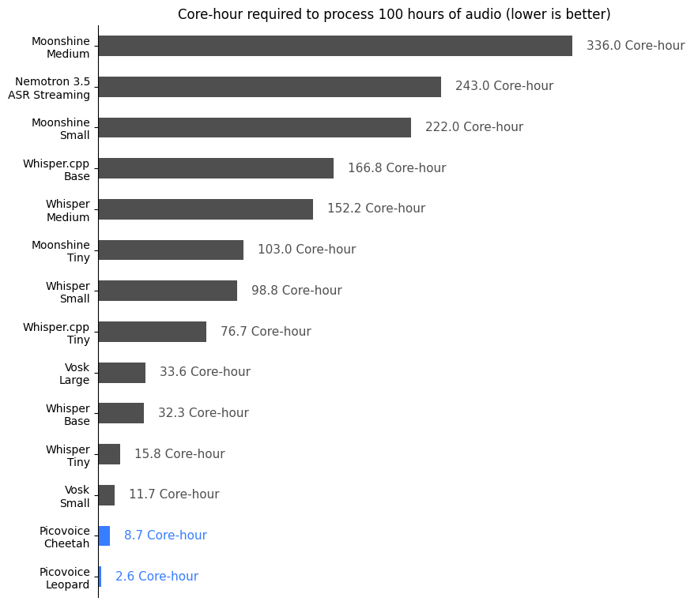

|            Engine             | Core-Hour | Model Size / MB |
|:-----------------------------:|:---------:|:---------------:|
|        Whisper Medium         |   1.52    |      1457       |
|         Whisper Small         |   0.99    |       462       |
|         Whisper Base          |   0.32    |       139       |
|         Whisper Tiny          |   0.16    |       73        |
|   Whisper.cpp Streaming Base  |   1.67    |       139       |
|   Whisper.cpp Streaming Tiny  |   0.77    |       73        |
|          Vosk Large           |   0.34    |      2733       |
|          Vosk Small           |   0.12    |       68        |
|   Moonshine Streaming Tiny    |   1.03    |       49        |
|  Moonshine Streaming Small    |   2.22    |       158       |
|  Moonshine Streaming Medium   |   3.36    |       290       |
|  Nemotron 3.5 ASR Streaming   |   2.43    |      2210       |
|      Picovoice Leopard        |   0.026   |       37        |
|      Picovoice Cheetah        |   0.087   |       34        |

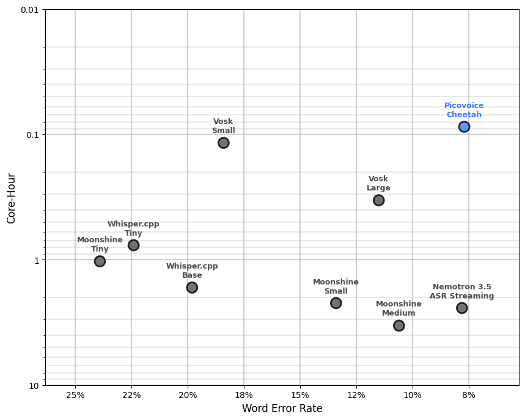

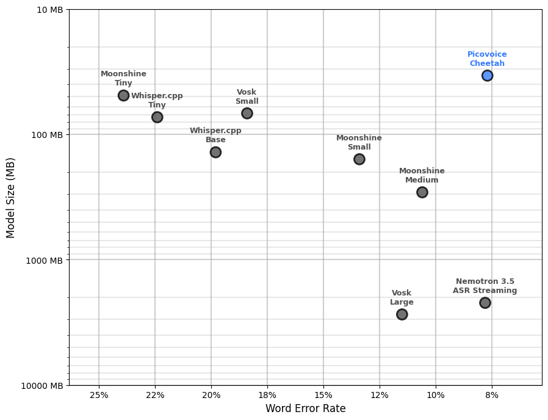

#### Word Emission Latency

To obtain these results, we used 100 randomly selected files from the LibriSpeech test-clean dataset.

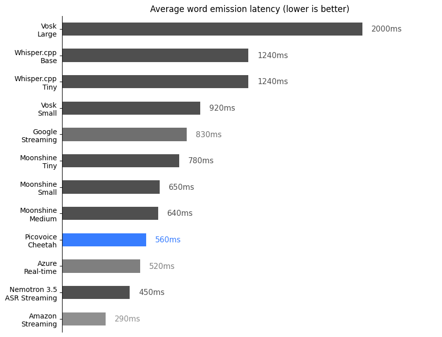

|              Engine             | Latency (ms) |
|:-------------------------------:|:------------:|
|  Azure Speech-to-Text Real-time |     500      |
|   Amazon Transcribe Streaming   |     300      |
| Google Speech-to-Text Streaming |     890      |
|    Nemotron 3.5 ASR Streaming   |     450      |
|    Whisper.cpp Streaming Tiny   |    1240      |
|    Whisper.cpp Streaming Base   |    1240      |
|          Vosk Small             |     920      |
|          Vosk Large             |    2000      |
|        Moonshine Tiny           |     780      |
|        Moonshine Small          |     650      |
|       Moonshine Medium          |     640      |
|       Picovoice Cheetah         |     560      |

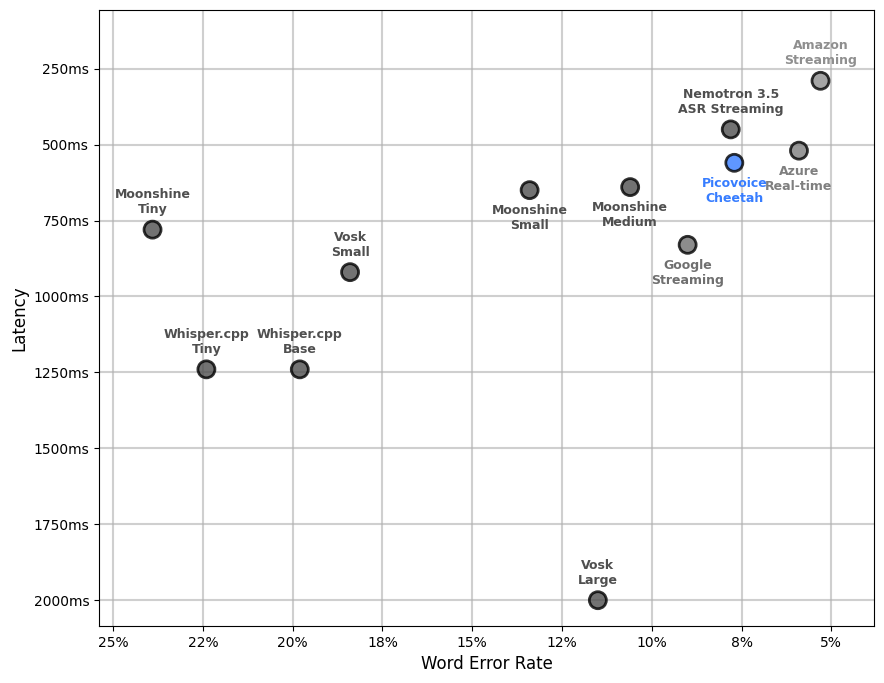

### French

#### Batch Engines Word Error Rate

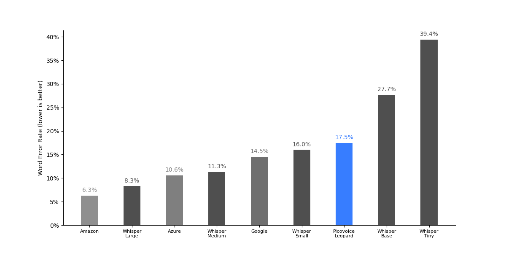

|             Engine             | CommonVoice | Multilingual LibriSpeech  | VoxPopuli | Average |
|:------------------------------:|:-----------:|:-------------------------:|:---------:|:-------:|
|       Amazon Transcribe        |    6.0%     |          4.4%             |   8.6%    |  6.3%   |
|      Azure Speech-to-Text      |    11.1%    |          9.0%             |   11.8%   |  10.6%  |
|     Google Speech-to-Text      |    14.3%    |          14.2%            |   15.1%   |  14.5%  |
|         Whisper Large          |    9.3%     |          4.6%             |   10.9%   |  8.3%   |
|         Whisper Medium         |    13.1%    |          8.6%             |   12.1%   |  11.3%  |
|         Whisper Small          |    19.2%    |          13.5%            |   15.3%   |  16.0%  |
|          Whisper Base          |    35.4%    |          24.4%            |   23.3%   |  27.7%  |
|          Whisper Tiny          |    49.8%    |          36.2%            |   32.1%   |  39.4%  |
|       Picovoice Leopard        |    15.9%    |          19.2%            |   17.5%   |  17.5%  |

#### Streaming Engines Word Error Rate

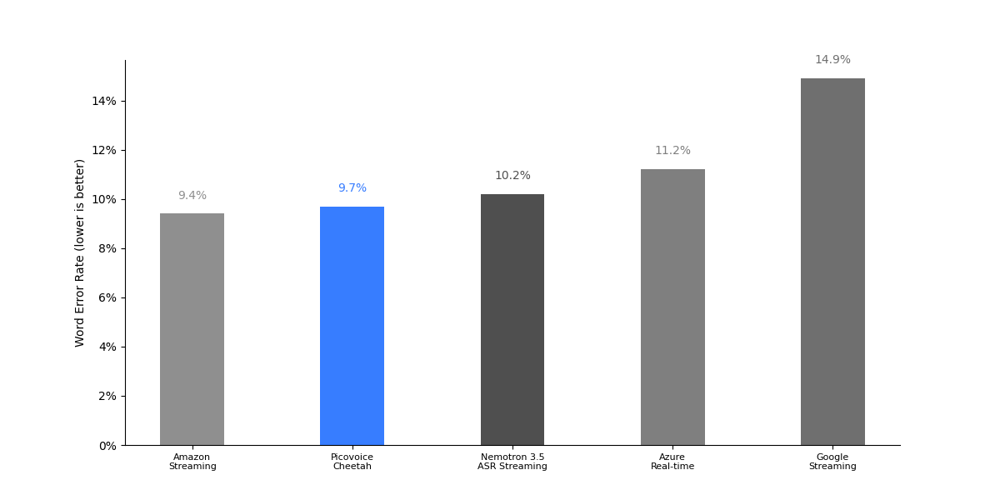

|             Engine             | CommonVoice | Multilingual LibriSpeech  | VoxPopuli | Average |
|:------------------------------:|:-----------:|:-------------------------:|:---------:|:-------:|
|   Amazon Transcribe Streaming  |     9.7%    |          7.7%             |   10.7%   |  9.4%   |
|  Azure Speech-to-Text Real Time|    11.5%    |          8.9%             |   13.1%   |  11.2%  |
| Google Speech-to-Text Streaming|    15.0%    |          14.5%            |   15.3%   |  14.9%  |
|   Nemotron 3.5 ASR Streaming   |    11.3%    |          8.0%             |   11.4%   |  10.2%  |
|       Picovoice Cheetah        |    10.6%    |          7.5%             |   11.1%   |  9.7%   |

#### Streaming Engines Punctuation Error Rate

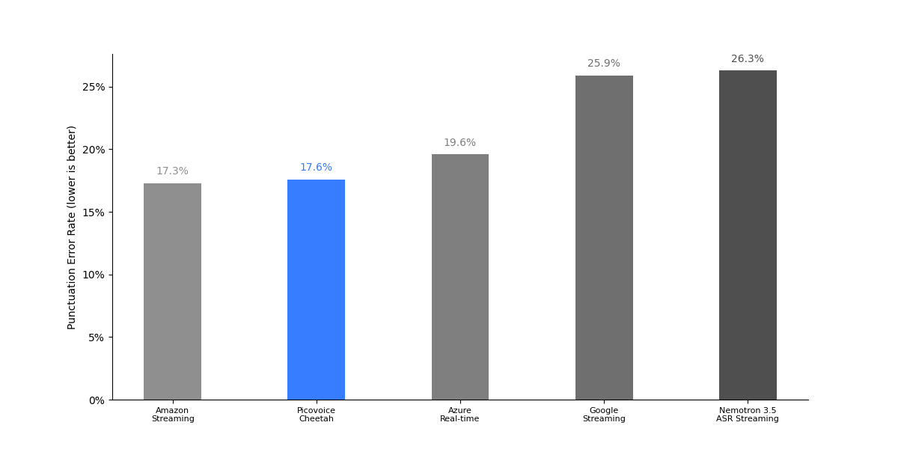

|             Engine             | CommonVoice | Fleurs | VoxPopuli | Average |
|:------------------------------:|:-----------:|:------:|:---------:|:-------:|
|   Amazon Transcribe Streaming  |    8.1%     | 20.2%  |   23.7%   |  17.3%  |
|  Azure Speech-to-Text Real Time|    7.6%     | 20.1%  |   31.2%   |  19.6%  |
| Google Speech-to-Text Streaming|    26.5%    | 22.7%  |   28.4%   |  25.9%  |
|   Nemotron 3.5 ASR Streaming   |    20.2%    | 30.6%  |   28.2%   |  26.3%  |
|       Picovoice Cheetah        |    5.2%     | 17.2%  |   30.4%   |  17.6%  |


### German

#### Batch Engines Word Error Rate

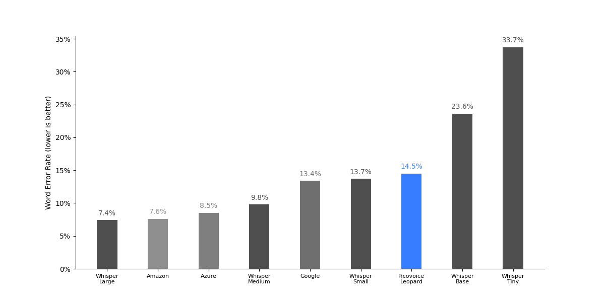

|             Engine             | CommonVoice | Multilingual LibriSpeech  | VoxPopuli | Average |
|:------------------------------:|:-----------:|:-------------------------:|:---------:|:-------:|
|       Amazon Transcribe        |    5.3%     |          2.9%             |   14.6%   |  7.6%   |
|      Azure Speech-to-Text      |    6.9%     |          5.4%             |   13.1%   |  8.5%   |
|     Google Speech-to-Text      |    9.2%     |          13.9%            |   17.2%   |  13.4%  |
|         Whisper Large          |    5.3%     |          4.4%             |   12.5%   |  7.4%   |
|         Whisper Medium         |    8.3%     |          7.6%             |   13.5%   |  9.8%   |
|         Whisper Small          |    13.8%    |          11.2%            |   16.2%   |  13.7%  |
|          Whisper Base          |    26.9%    |          19.8%            |   24.0%   |  23.6%  |
|          Whisper Tiny          |    39.5%    |          28.6%            |   33.0%   |  33.7%  |
|       Picovoice Leopard        |    8.2%     |          11.6%            |   23.6%   |  14.5%  |

#### Streaming Engines Word Error Rate

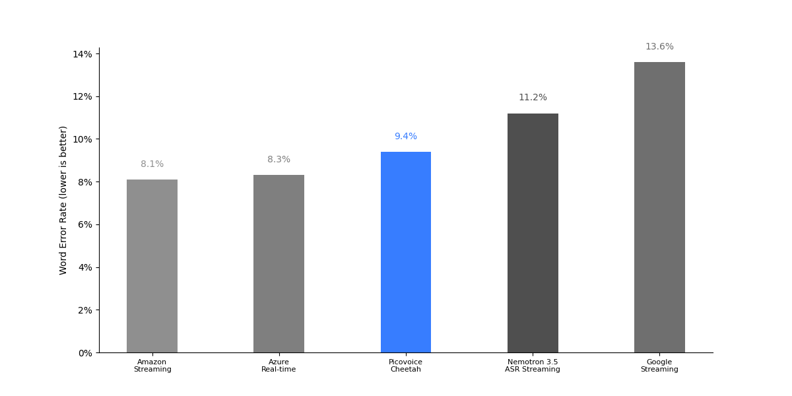

|             Engine             | CommonVoice | Multilingual LibriSpeech  | VoxPopuli | Average |
|:------------------------------:|:-----------:|:-------------------------:|:---------:|:-------:|
|   Amazon Transcribe Streaming  |    6.1%     |          6.5%             |   11.6%   |  8.1%   |
|  Azure Speech-to-Text Real Time|    6.4%     |          5.1%             |   13.4%   |  8.3%   |
| Google Speech-to-Text Streaming|    9.4%     |          14.0%            |   17.5%   |  13.6%  |
|   Nemotron 3.5 ASR Streaming   |    10.2%    |          9.0%             |   14.3%   |  11.2%  |
|       Picovoice Cheetah        |    7.3%     |          7.6%             |   13.3%   |  9.4%   |

#### Streaming Engines Punctuation Error Rate

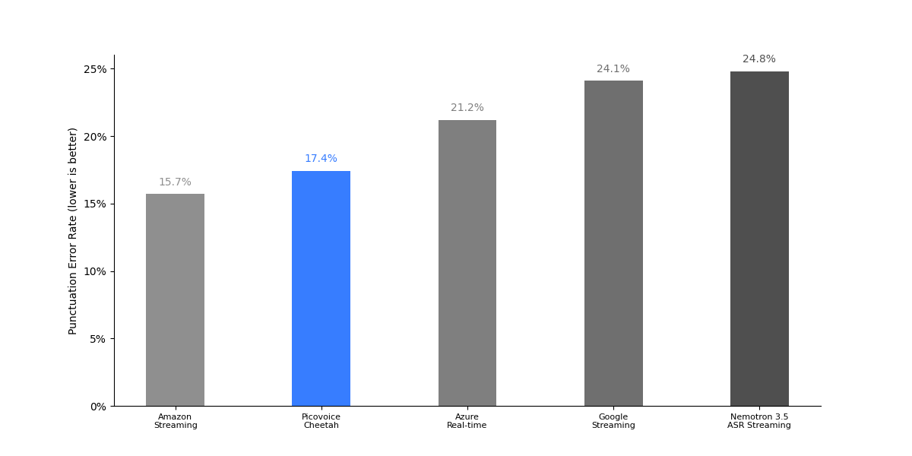

|             Engine             | CommonVoice | Fleurs | VoxPopuli | Average |
|:------------------------------:|:-----------:|:------:|:---------:|:-------:|
|   Amazon Transcribe Streaming  |    3.6%     | 23.4%  |   20.1%   |  15.7%  |
|  Azure Speech-to-Text Real Time|    5.7%     | 29.3%  |   28.6%   |  21.2%  |
| Google Speech-to-Text Streaming|    6.4%     | 27.5%  |   28.5%   |  24.1%  |
|   Nemotron 3.5 ASR Streaming   |    17.2%    | 26.1%  |   31.0%   |  24.8%  |
|       Picovoice Cheetah        |    2.1%     | 24.9%  |   25.1%   |  17.4%  |

### Italian

#### Batch Engines Word Error Rate

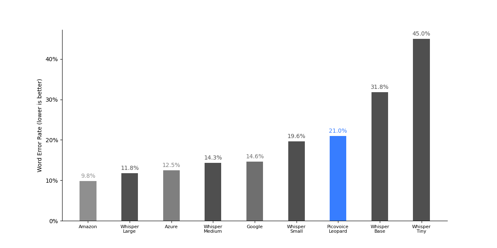

|             Engine             | CommonVoice | Multilingual LibriSpeech  | VoxPopuli | Average |
|:------------------------------:|:-----------:|:-------------------------:|:---------:|:-------:|
|       Amazon Transcribe        |    4.1%     |          9.1%             |   16.1%   |  9.8%   |
|      Azure Speech-to-Text      |    5.8%     |          14.0%            |   17.8%   |  12.5%  |
|     Google Speech-to-Text      |    5.5%     |          19.6%            |   18.7%   |  14.6%  |
|         Whisper Large          |    4.9%     |          8.8%             |   21.8%   |  11.8%  |
|         Whisper Medium         |    8.7%     |          14.9%            |   19.3%   |  14.3%  |
|         Whisper Small          |    15.4%    |          20.6%            |   22.7%   |  19.6%  |
|          Whisper Base          |    32.3%    |          31.6%            |   31.6%   |  31.8%  |
|          Whisper Tiny          |    48.1%    |          43.3%            |   43.5%   |  45.0%  |
|       Picovoice Leopard        |    13.0%    |          27.7%            |   22.2%   |  21.0%  |

#### Streaming Engines Word Error Rate

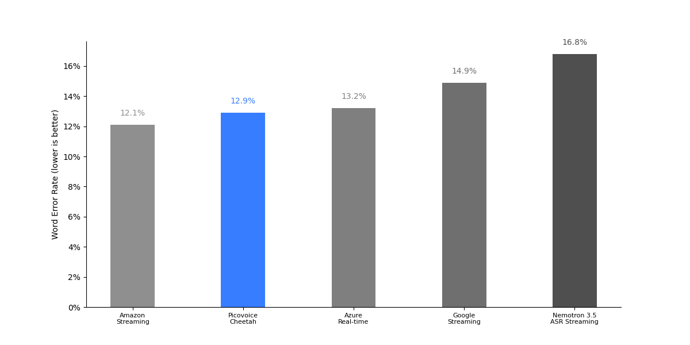

|             Engine             | CommonVoice | Multilingual LibriSpeech  | VoxPopuli | Average |
|:------------------------------:|:-----------:|:-------------------------:|:---------:|:-------:|
|   Amazon Transcribe Streaming  |    4.9%     |          10.8%            |   20.7%   |  12.1%  |
|  Azure Speech-to-Text Real Time|    5.9%     |          14.2%            |   19.4%   |  13.2%  |
| Google Speech-to-Text Streaming|    5.9%     |          14.2%            |   19.4%   |  13.2%  |
|   Nemotron 3.5 ASR Streaming   |    8.4%     |          18.5%            |   23.5%   |  16.8%  |
|       Picovoice Cheetah        |    7.7%     |          13.2%            |   17.7%   |  12.9%  |

#### Streaming Engines Punctuation Error Rate

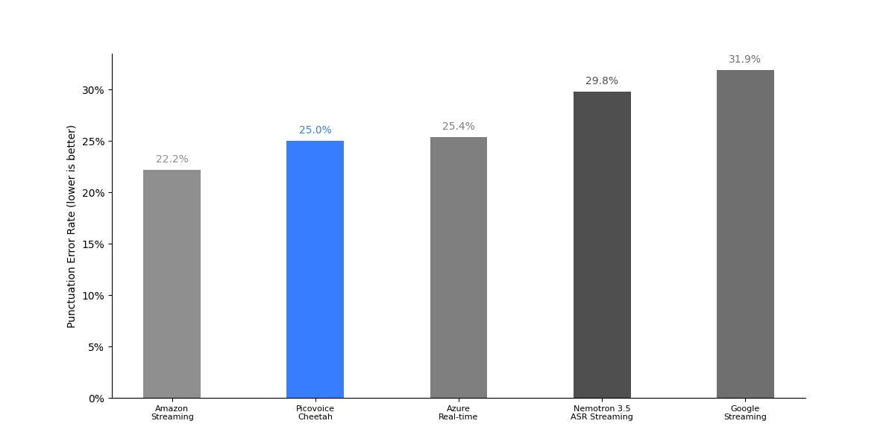

|             Engine             | CommonVoice | Fleurs | VoxPopuli | Average |
|:------------------------------:|:-----------:|:------:|:---------:|:-------:|
|   Amazon Transcribe Streaming  |    4.2%     | 27.7%  |   34.7%   |  22.2%  |
|  Azure Speech-to-Text Real Time|    6.1%     | 28.6%  |   41.6%   |  25.4%  |
| Google Speech-to-Text Streaming|    27.3%    | 23.3%  |   45.0%   |  31.9%  |
|   Nemotron 3.5 ASR Streaming   |    23.9%    | 23.2%  |   42.3%   |  29.8%  |
|       Picovoice Cheetah        |    2.6%     | 25.0%  |   47.4%   |  25.0%  |

### Spanish

#### Batch Engines Word Error Rate

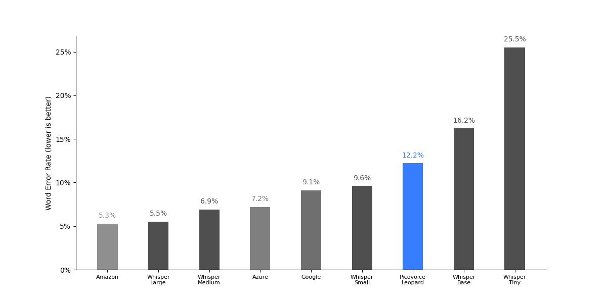

|             Engine             | CommonVoice | Multilingual LibriSpeech  | VoxPopuli | Average |
|:------------------------------:|:-----------:|:-------------------------:|:---------:|:-------:|
|       Amazon Transcribe        |    3.9%     |          3.3%             |   8.7%    |  5.3%   |
|      Azure Speech-to-Text      |    6.3%     |          5.8%             |   9.4%    |  7.2%   |
|     Google Speech-to-Text      |    6.6%     |          9.2%             |   11.6%   |  9.1%   |
|         Whisper Large          |    4.0%     |          2.9%             |   9.7%    |  5.5%   |
|         Whisper Medium         |    6.2%     |          4.8%             |   9.7%    |  6.9%   |
|         Whisper Small          |    9.8%     |          7.7%             |   11.4%   |  9.6%   |
|          Whisper Base          |    20.2%    |          13.0%            |   15.3%   |  16.2%  |
|          Whisper Tiny          |    33.3%    |          20.6%            |   22.7%   |  25.5%  |
|       Picovoice Leopard        |    7.6%     |          14.9%            |   14.1%   |  12.2%  |

#### Streaming Engines Word Error Rate

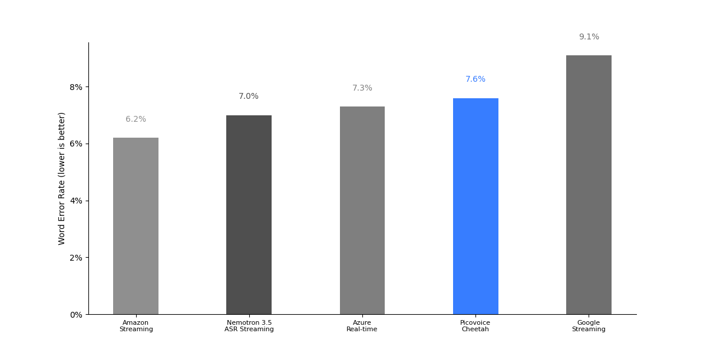

|             Engine             | CommonVoice | Multilingual LibriSpeech  | VoxPopuli | Average |
|:------------------------------:|:-----------:|:-------------------------:|:---------:|:-------:|
|   Amazon Transcribe Streaming  |    5.2%     |          4.8%             |   8.7%    |  6.2%   |
|  Azure Speech-to-Text Real Time|    6.4%     |          6.1%             |   9.4%    |  7.3%   |
| Google Speech-to-Text Streaming|    6.6%     |          9.2%             |   11.6%   |  9.1%   |
|   Nemotron 3.5 ASR Streaming   |    7.2%     |          5.4%             |   8.5%    |  7.0%   |
|       Picovoice Cheetah        |    7.5%     |          5.5%             |   9.8%    |  7.6%   |

#### Streaming Engines Punctuation Error Rate

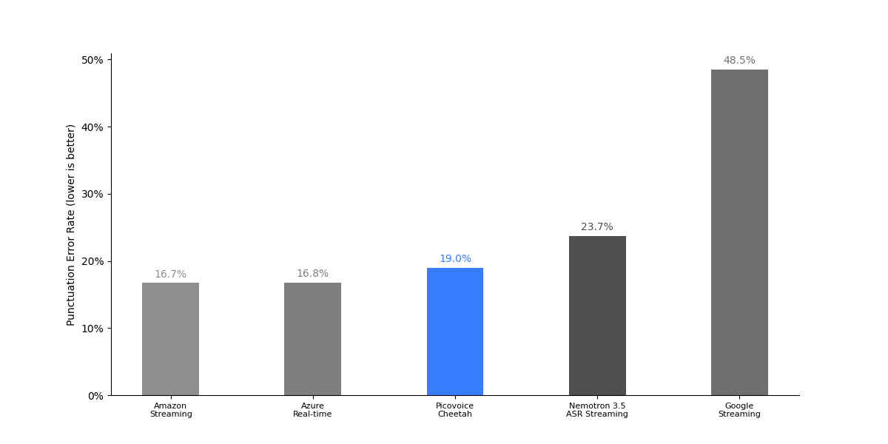

|             Engine             | CommonVoice | Fleurs | VoxPopuli | Average |
|:------------------------------:|:-----------:|:------:|:---------:|:-------:|
|   Amazon Transcribe Streaming  |    6.3%     | 18.7%  |   25.0%   |  16.7%  |
|  Azure Speech-to-Text Real Time|    4.4%     | 18.6%  |   27.3%   |  16.8%  |
| Google Speech-to-Text Streaming|    58.7%    | 45.0%  |   41.9%   |  48.5%  |
|   Nemotron 3.5 ASR Streaming   |    19.2%    | 20.0%  |   32.0%   |  23.7%  |
|       Picovoice Cheetah        |    3.1%     | 18.5%  |   35.5%   |  19.0%  |

### Portuguese

For Amazon Transcribe, Azure Speech-to-Text, and Google Speech-to-Text, we report results with the language set to `PT-BR`, as this achieves better results compared to `PT-PT` across all engines.

#### Batch Engines Word Error Rate

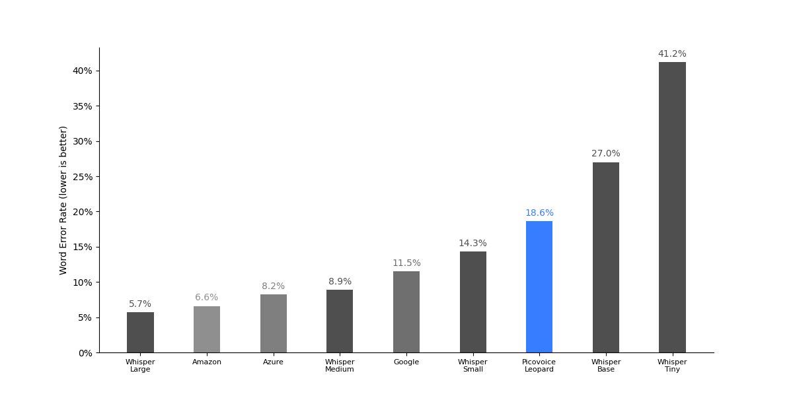

|             Engine             | CommonVoice | Multilingual LibriSpeech  | Average |
|:------------------------------:|:-----------:|:-------------------------:|:-------:|
|       Amazon Transcribe        |    5.4%     |          7.8%             |  6.6%   |
|      Azure Speech-to-Text      |    7.4%     |          9.0%             |  8.2%   |
|     Google Speech-to-Text      |    8.8%     |          14.2%            |  11.5%  |
|         Whisper Large          |    5.9%     |          5.4%             |  5.7%   |
|         Whisper Medium         |    9.6%     |          8.1%             |  8.9%   |
|         Whisper Small          |    15.6%    |          13.0%            |  14.3%  |
|          Whisper Base          |    31.2%    |          22.7%            |  27.0%  |
|          Whisper Tiny          |    47.7%    |          34.6%            |  41.2%  |
|       Picovoice Leopard        |    17.1%    |          20.0%            |  18.6%  |

#### Streaming Engines Word Error Rate

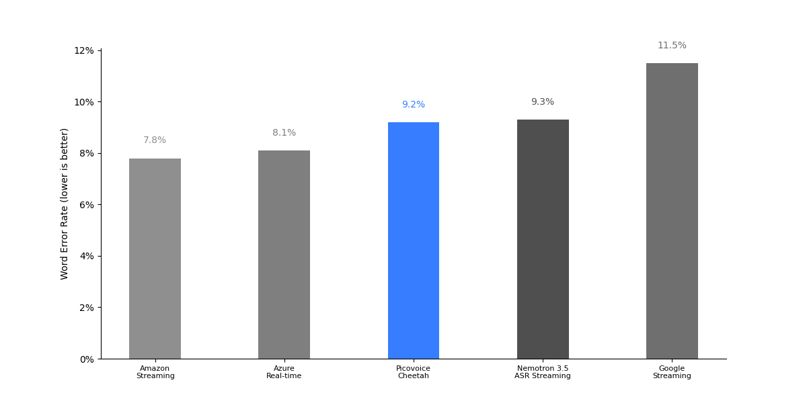

|             Engine             | CommonVoice | Multilingual LibriSpeech  | Average |
|:------------------------------:|:-----------:|:-------------------------:|:-------:|
|   Amazon Transcribe Streaming  |    6.2%     |          9.4%             |  7.8%   |
|  Azure Speech-to-Text Real Time|    7.5%     |          8.7%             |  8.1%   |
| Google Speech-to-Text Streaming|    9.0%     |          14.0%            |  11.5%  |
|   Nemotron 3.5 ASR Streaming   |    10.2%    |          8.3%             |  9.3%   |
|       Picovoice Cheetah        |    8.1%     |          10.3%            |  9.2%   |

#### Streaming Engines Punctuation Error Rate

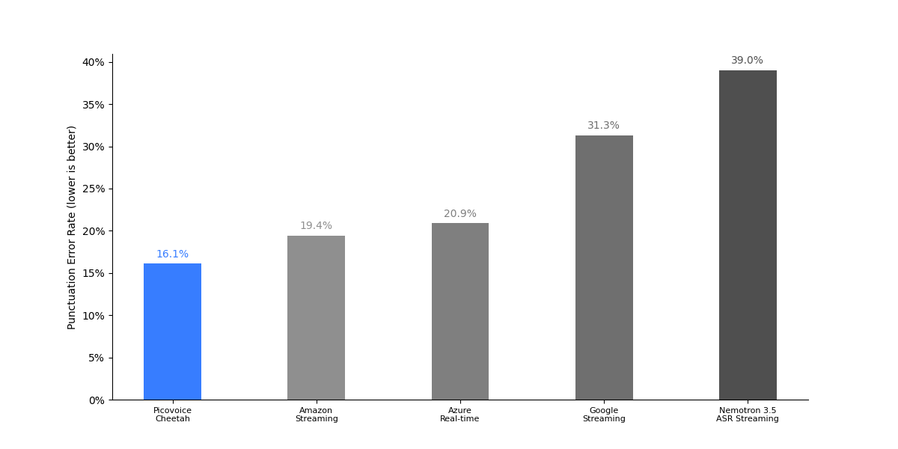

|             Engine             | CommonVoice | Fleurs | Average |
|:------------------------------:|:-----------:|:------:|:-------:|
|   Amazon Transcribe Streaming  |    10.0%    | 28.8%  |  19.4%  |
|  Azure Speech-to-Text Real Time|    13.6%    | 28.2%  |  20.9%  |
| Google Speech-to-Text Streaming|    30.9%    | 31.7%  |  31.3%  |
|   Nemotron 3.5 ASR Streaming   |    38.8%    | 39.2%  |  39.0%  |
|       Picovoice Cheetah        |    7.7%     | 24.4%  |  16.1%  |

### Korean

#### Streaming Engines Character Error Rate

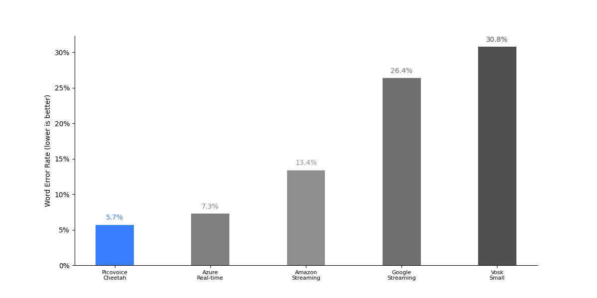

|             Engine             | CommonVoice | Zeroth Korean | Pansori | Average |
|:------------------------------:|:-----------:|:-------------:|:-------:|:-------:|
|   Amazon Transcribe Streaming  |    14.8%    |     13.3%     |  5.1%   |  7.3%   |
|  Azure Speech-to-Text Real Time|    8.1%     |     8.6%      |  12.1%  |  9.6%   |
| Google Speech-to-Text Streaming|    32.0%    |     33.7%     |  13.5%  |  26.4%  |
|          Vosk Small            |    39.0%    |     12.7%     |  40.7%  |  30.8%  |
|       Picovoice Cheetah        |    7.0%     |     3.7%      |  6.5%   |  5.7%   |

#### Streaming Engines Punctuation Error Rate

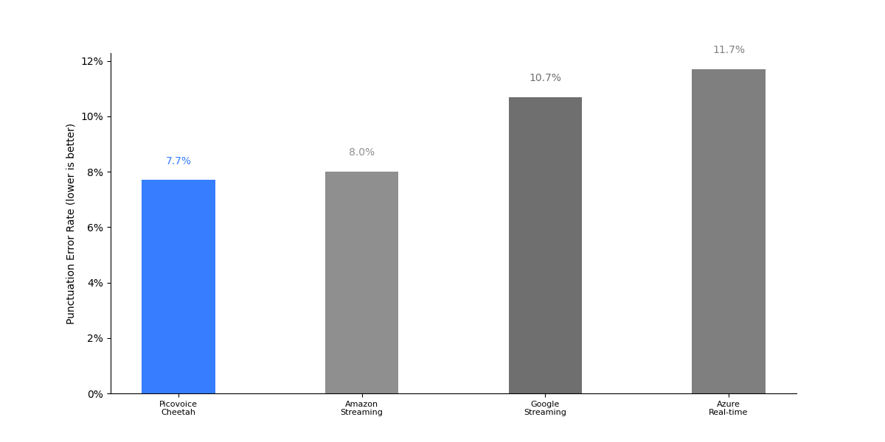

|             Engine             | CommonVoice | Fleurs | Average |
|:------------------------------:|:-----------:|:------:|:-------:|
|   Amazon Transcribe Streaming  |    6.5%     | 9.4%   |  8.0%   |
|  Azure Speech-to-Text Real Time|    11.7%    | 11.6%  |  11.7%  |
| Google Speech-to-Text Streaming|    12.1%    | 9.3%   |  10.7%  |
|       Picovoice Cheetah        |    12.5%    | 2.9%   |  7.7%   |

### Japanese

#### Streaming Engines Character Error Rate

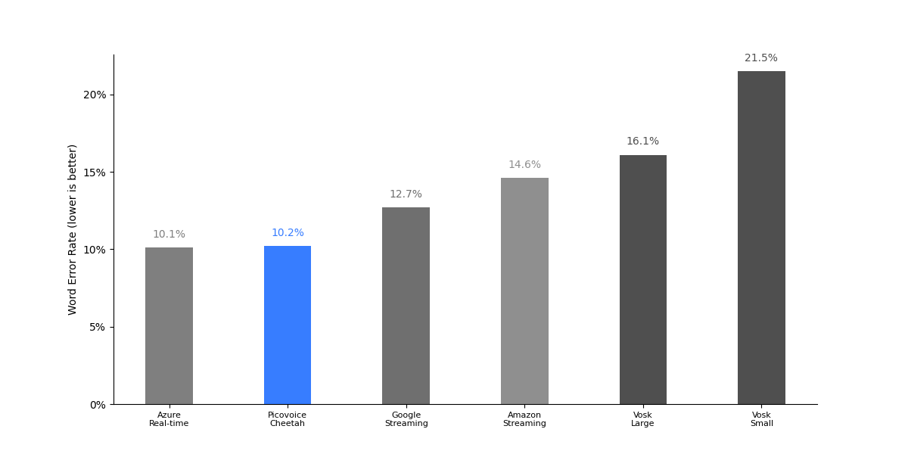

|             Engine              | CommonVoice |   JSUT Basic   | Fleurs | Average |
|:-------------------------------:|:-----------:|:--------------:|:------:|:-------:|
|   Amazon Transcribe Streaming   |    23.2%    |     10.0%      | 10.7%  |  14.6%  |
| Azure Speech-to-Text Real-time  |    16.6%    |      7.6%      |  6.2%  |  10.1%  |
| Google Speech-to-Text Streaming |    20.1%    |      9.3%      |  8.6%  |  12.7%  |
|      Vosk Streaming Large       |    23.6%    |      7.1%      | 17.5%  |  16.1%  |
|      Vosk Streaming Small       |    31.1%    |     11.0%      | 21.4%  |  21.2%  |
|        Picovoice Cheetah        |    14.1%    |      8.6%      |  7.8%  |  10.2%  |

#### Streaming Engines Punctuation Error Rate

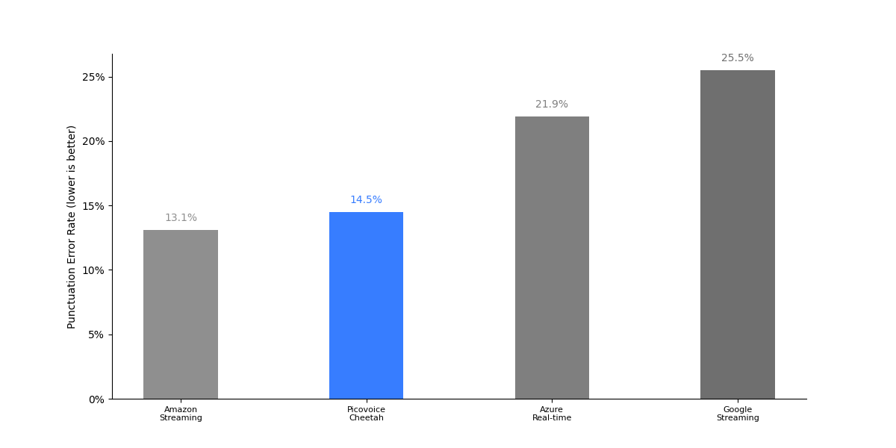

|             Engine              | CommonVoice | Fleurs | Average |
|:-------------------------------:|:-----------:|:------:|:-------:|
|   Amazon Transcribe Streaming   |    20.7%    |  5.5%  |  13.1%  |
| Azure Speech-to-Text Real-time  |    23.7%    | 20.0%  |  21.8%  |
| Google Speech-to-Text Streaming |    28.6%    | 22.3%  |  25.4%  |
|        Picovoice Cheetah        |    26.3%    |  2.6%  |  14.5%  |
