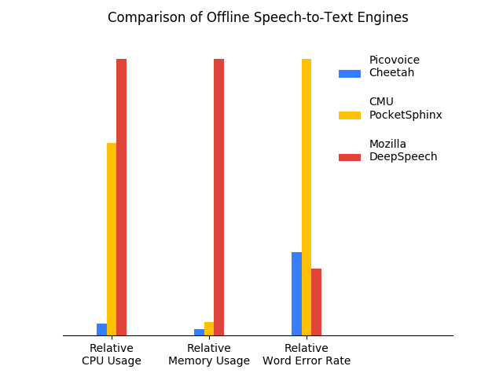

# Speech-to-Text Benchmark

Made in Vancouver, Canada by [Picovoice](https://picovoice.ai)

This is a minimalist and extensible framework for benchmarking different speech-to-text engines. It has been developed
and tested on Ubuntu 18.04 (x86_64) using Python3.6.

## Table of Contents

* [Background](#background)
* [Data](#data)
* [Metrics](#metrics)
    * [Word Error Rate](#word-error-rate)
    * [Real Time Factor](#real-time-factor)
    * [Model Size](#model-size)
* [Speech-to-Text Engines](#speech-to-text-engines)
    * [Amazon Transcribe](#amazon-transcribe)
    * [CMU PocketSphinx](#cmu-pocketsphinx)
    * [Google Speech-to-Text](#google-speech-to-text)
    * [Mozilla DeepSpeech](#mozilla-deepspeech)
    * [Picovoice Cheetah](#picovoice-cheetah)
    * [Picovoice Leopard](#picovoice-leopard)
* [Usage](#usage)
    * [Word Error Rate Measurement](#word-error-rate-measurement)
    * [Real Time Factor Measurement](#real-time-factor-measurement)
* [Results](#results)
* [License](#license)

## Background

This framework has been developed by [Picovoice](http://picovoice.ai/) as part of the
[Cheetah](https://github.com/Picovoice/cheetah) project. Cheetah is Picovoice's streaming speech-to-text engine,
specifically designed to run efficiently on the edge (offline). Deep learning has been the main driver in recent
improvements in speech recognition but due to stringent compute/storage limitations of IoT platforms, it is mostly
beneficial to cloud-based engines. Picovoice's proprietary deep learning technology enables transferring these
improvements to IoT platforms with significantly lower CPU/memory footprint.

## Data

[LibriSpeech](http://www.openslr.org/12/) dataset is used for benchmarking. We use the
[test-clean](http://www.openslr.org/resources/12/test-clean.tar.gz) portion.

## Metrics

This benchmark considers three metrics: word error rate, real-time factor, and model size.

### Word Error Rate

Word error rate (WER) is defined as the ratio of [Levenstein distance](https://en.wikipedia.org/wiki/Levenshtein_distance)
between words in a reference transcript and words in the output of the speech-to-text engine, to the number of
words in the reference transcript.

### Real Time Factor

Real time factor (RTF) is measured as the ratio of CPU (processing) time to the length of the input speech file. A
speech-to-text engine with lower RTF is more computationally efficient. We omit this metric for cloud-based engines.

### Model Size

The aggregate size of models (acoustic and language), in MB. We omit this metric for cloud-based engines.

## Speech-to-Text Engines

### Amazon Transcribe

Amazon Transcribe is a cloud-based speceh recognition engine, offered by AWS. Find more information [here](https://aws.amazon.com/transcribe/).

### CMU PocketSphinx

[PocketSphinx](https://github.com/cmusphinx/pocketsphinx) works offline and can run on embedded platforms such as
Raspberry Pi.

### Google Speech-to-Text

A cloud-based speech recognition engine offered by Google Cloud Platform. Find more information
[here](https://cloud.google.com/speech-to-text/).

### Mozilla DeepSpeech

[Mozilla DeepSpeech](https://github.com/mozilla/DeepSpeech) is an open-source implementation of
[Baidu's DeepSpeech](https://arxiv.org/abs/1412.5567) by Mozilla.

### Picovoice Cheetah

[Cheetah](https://github.com/Picovoice/cheetah) is a streaming speech-to-text engine developed using
[Picovoice's](http://picovoice.ai/) proprietary deep learning technology. It works offline and is supported on a
growing number of platforms including Android, iOS, and Raspberry Pi.

### Picovoice Leopard

[Leopard](https://github.com/Picovoice/leopard) is a speech-to-text engine developed using
[Picovoice's](http://picovoice.ai/) proprietary deep learning technology. It works offline and is supported on a
growing number of platforms including Android, iOS, and Raspberry Pi.

## Usage

Below is information on how to use this framework to benchmark the speech-to-text engines. 

1. Make sure that you have installed DeepSpeech and PocketSphinx on your machine by following the instructions on their official pages.
1. Unpack
DeepSpeech's models under [resources/deepspeech](/resources/deepspeech).
1. Download the [test-clean](http://www.openslr.org/resources/12/test-clean.tar.gz) portion of LibriSpeech and unpack it under
[resources/data](/resources/data).
1. For running Google Speech-to-Text and Amazon Transcribe, you need to sign up for the respective cloud provider
and setup permissions / credentials according to their documentation. Running these services may incur fees.

### Word Error Rate Measurement

Word Error Rate can be measured by running the following command from the root of the repository: 

```bash
python benchmark.py --engine_type AN_ENGINE_TYPE
```

The valid options for the `engine_type`
parameter are: `AMAZON_TRANSCRIBE`, `CMU_POCKET_SPHINX`, `GOOGLE_SPEECH_TO_TEXT`, `MOZILLA_DEEP_SPEECH`,
`PICOVOICE_CHEETAH`, `PICOVOICE_CHEETAH_LIBRISPEECH_LM`, `PICOVOICE_LEOPARD`, and `PICOVOICE_LEOPARD_LIBRISPEECH_LM`.

`PICOVOICE_CHEETAH_LIBRISPEECH_LM` is the same as `PICOVOICE_CHEETAH`
except that the language model is trained on LibriSpeech training text similar to
[Mozilla DeepSpeech](https://github.com/mozilla/DeepSpeech/tree/master/data/lm). The same applies to Leopard.


### Real Time Factor Measurement

The `time` command is used to measure the execution time of different engines for a given audio file, and then divide
the CPU time by audio length. To measure the execution time for Cheetah, run:

```bash
time resources/cheetah/cheetah_demo \
resources/cheetah/libpv_cheetah.so \
resources/cheetah/acoustic_model.pv \
resources/cheetah/language_model.pv \
resources/cheetah/cheetah_eval_linux.lic \
PATH_TO_WAV_FILE
```

The output should have the following format (values may be different):

```bash
real	0m4.961s
user	0m4.936s
sys	0m0.024s
```

Then, divide the `user` value by the length of the audio file, in seconds. The user value is the actual CPU time spent in the program.

To measure the execution time for Leopard, run:

```bash
time resources/leopard/leopard_demo \
resources/leopard/libpv_leopard.so \
resources/leopard/acoustic_model.pv \
resources/leopard/language_model.pv \
resources/leopard/leopard_eval_linux.lic \
PATH_TO_WAV_FILE
```

For DeepSpeech:

```bash
time deepspeech \
--model resources/deepspeech/output_graph.pbmm \
--lm resources/deepspeech/lm.binary \
--trie resources/deepspeech/trie \
--audio PATH_TO_WAV_FILE
```

Finally, for PocketSphinx:

```bash
time pocketsphinx_continuous -infile PATH_TO_WAV_FILE
```

## Results

The below results are obtained by following the previous steps. The benchmarking was performed on a Linux machine running
Ubuntu 18.04 with 64GB of RAM and an Intel i5-6500 CPU running at 3.2 GHz. WER refers to word error rate and RTF refers to
real time factor.

| Engine | WER | RTF (Desktop) | RTF (Raspberry Pi 3) | RTF (Raspberry Pi Zero) | Model Size (Acoustic and Language) |
:---:|:---:|:---:|:---:|:---:|:---:
Amazon Transcribe | 8.21% | N/A | N/A | N/A | N/A |
CMU PocketSphinx (0.1.15) | 31.82% | 0.32 | 1.87 | **2.04** | 97.8 MB |
Google Speech-to-Text | 12.23% | N/A | N/A | N/A | N/A |
Mozilla DeepSpeech (0.6.1) | 7.55% | 0.46  | N/A | N/A | 1146.8 MB |
Picovoice Cheetah (v1.2.0) | 10.49% | 0.04 | 0.62 | 3.11 | 47.9 MB |
Picovoice Cheetah LibriSpeech LM (v1.2.0) | 8.25% | 0.04 | 0.62 | 3.11 | **45.0 MB** |
Picovoice Leopard (v1.0.0) | 8.34% | **0.02** | **0.55** | 2.55 | 47.9 MB |
Picovoice Leopard LibriSpeech LM (v1.0.0) | **6.58%** | **0.02** | **0.55** | 2.55 | **45.0 MB** |

The figure below compares the word error rate of speech-to-text engines. For Picovoice, we included the engine that was
trained on LibriSpeech training data similar to Mozilla DeepSpeech.


The figure below compares accuracy and runtime metrics of offline speech-to-text engines. For Picovoice we included the
engines that were trained on LibriSpeech training data similar to Mozilla DeepSpeech. Leopard achieves the highest accuracy
while being 23X faster and 27X smaller in size compared to second most accurate engine (Mozilla DeepSpeech).



## License

The benchmarking framework is freely available and can be used under the Apache 2.0 license. The provided Cheetah and Leopard
resources (binary, model, and license file) are the property of Picovoice. They are only to be used for evaluation
purposes and their use in any commercial product is strictly prohibited.

For commercial enquiries contact us via this [form](https://picovoice.ai/contact.html).
