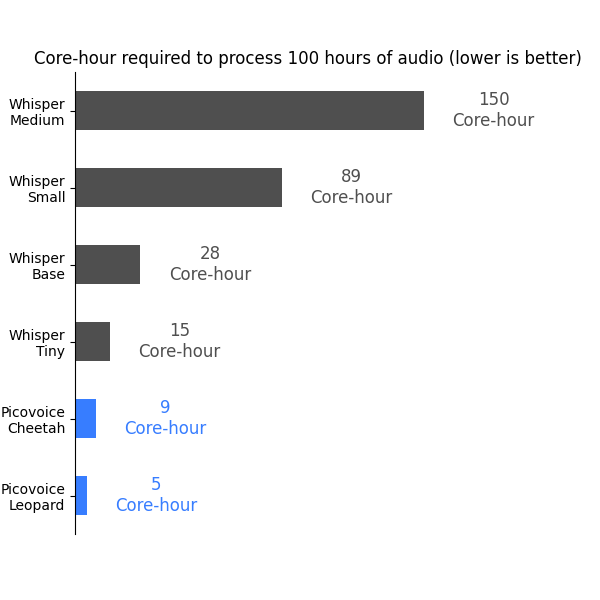
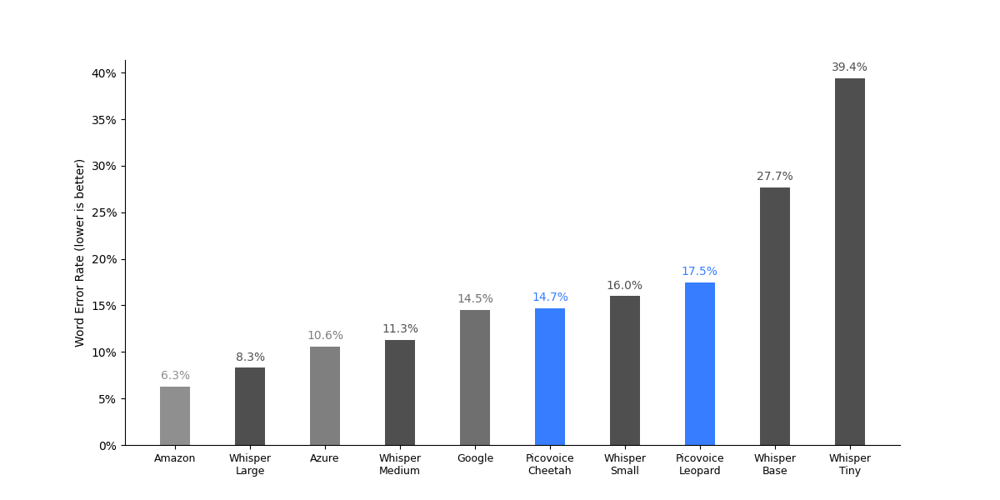
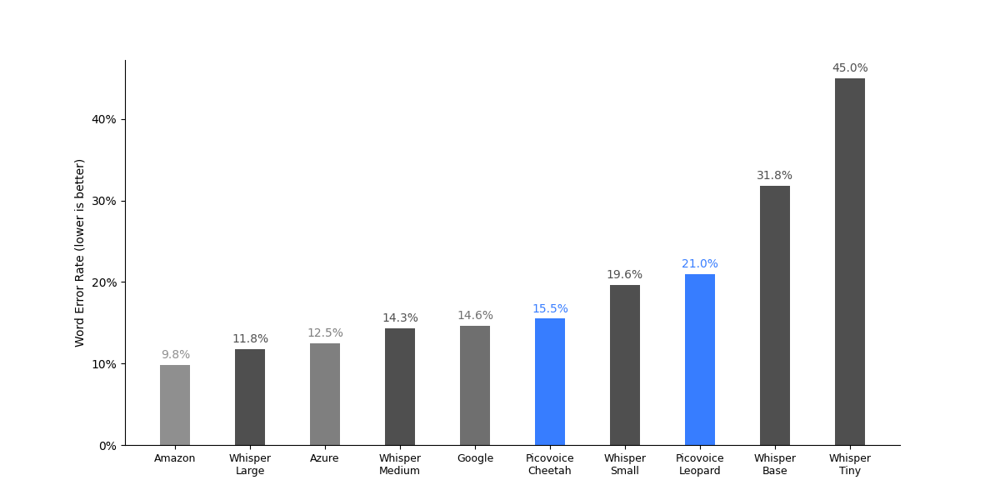
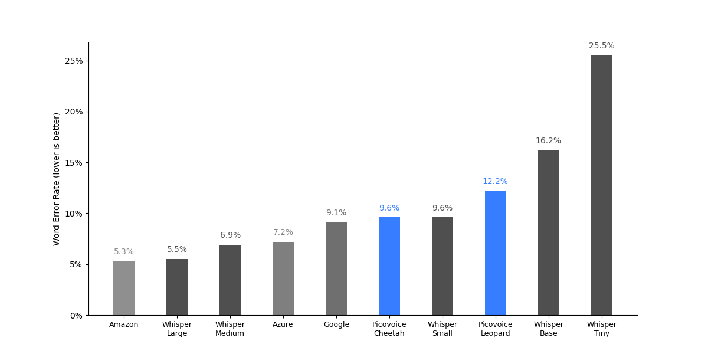

# Speech-to-Text Benchmark

Made in Vancouver, Canada by [Picovoice](https://picovoice.ai)

This repo is a minimalist and extensible framework for benchmarking different speech-to-text engines.

## Table of Contents

- [Data](#data)
- [Metrics](#metrics)
- [Engines](#engines)
- [Usage](#usage)
- [Results](#results)

## Data

- [LibriSpeech](http://www.openslr.org/12/)
- [TED-LIUM](https://www.openslr.org/7/)
- [Common Voice](https://commonvoice.mozilla.org/en)
- [Multilingual LibriSpeech](https://openslr.org/94)
- [VoxPopuli](https://github.com/facebookresearch/voxpopuli)
- [Fleurs](https://huggingface.co/datasets/google/fleurs) ([Download instructions](#fleurs-download-instructions))

## Metrics

### Word Error Rate

Word error rate (WER) is the ratio of edit distance between words in a reference transcript and the words in the output
of the speech-to-text engine to the number of words in the reference transcript.

### Punctuation Error Rate

Punctuation Error Rate (PER) is the ratio of punctuation-specific errors between a reference transcript and the output of a speech-to-text engine to the number of punctuation-related operations in the reference transcript (more details in Section 3 of [Meister et al.](https://arxiv.org/abs/2310.02943)). We report PER results for periods (.) and question marks (?).

### Core-Hour

The Core-Hour metric is used to evaluate the computational efficiency of the speech-to-text engine,
indicating the number of CPU hours required to process one hour of audio. A speech-to-text
engine with lower Core-Hour is more computationally efficient. We omit this metric for cloud-based engines.

### Model Size

The aggregate size of models (acoustic and language), in MB. We omit this metric for cloud-based engines.

## Engines

- [Amazon Transcribe](https://aws.amazon.com/transcribe/)
- [Azure Speech-to-Text](https://azure.microsoft.com/en-us/services/cognitive-services/speech-to-text/)
- [Google Speech-to-Text](https://cloud.google.com/speech-to-text)
- [IBM Watson Speech-to-Text](https://www.ibm.com/ca-en/cloud/watson-speech-to-text)
- [OpenAI Whisper](https://github.com/openai/whisper)
- [Picovoice Cheetah](https://picovoice.ai/)
- [Picovoice Leopard](https://picovoice.ai/)

## Usage

This benchmark has been developed and tested on `Ubuntu 22.04`.

- Install [FFmpeg](https://www.ffmpeg.org/)
- Download datasets.
- Install the requirements:

```console
pip3 install -r requirements.txt
```

In the following, we provide instructions for running the benchmark for each engine. 
The supported datasets are: 
`COMMON_VOICE`, `LIBRI_SPEECH_TEST_CLEAN`, `LIBRI_SPEECH_TEST_OTHER`, `TED_LIUM`, `MLS`, `VOX_POPULI` and `FLEURS`.
The supported languages are:
`EN`, `FR`, `DE`, `ES`, `IT`, `PT_BR`, and `PT_PT`.

To evaluate PER, use the `--punctuation` flag.
Use `--punctuation-set ${PUNCTUATION_SET}` to select which punctuation marks to calculate PER against, where `${PUNCTUATION_SET}` is one or more of `.`, `?` and `,` (default `.?`).

### Amazon Transcribe Instructions

Replace `${DATASET}` with one of the supported datasets, `${DATASET_FOLDER}` with path to dataset, `${LANGUAGE}` with the target language, and `${AWS_PROFILE}`
with the name of AWS profile you wish to use.

```console
python3 benchmark.py \
--dataset ${DATASET} \
--dataset-folder ${DATASET_FOLDER} \
--language ${LANGUAGE} \
--engine AMAZON_TRANSCRIBE \
--aws-profile ${AWS_PROFILE}
```

### Azure Speech-to-Text Instructions

Replace `${DATASET}` with one of the supported datasets, `${DATASET_FOLDER}` with path to dataset, `${LANGUAGE}` with the target language,
`${AZURE_SPEECH_KEY}` and `${AZURE_SPEECH_LOCATION}` information from your Azure account.

```console
python3 benchmark.py \
--dataset ${DATASET} \
--dataset-folder ${DATASET_FOLDER} \
--language ${LANGUAGE} \
--engine AZURE_SPEECH_TO_TEXT \
--azure-speech-key ${AZURE_SPEECH_KEY}
--azure-speech-location ${AZURE_SPEECH_LOCATION}
```

### Google Speech-to-Text Instructions

Replace `${DATASET}` with one of the supported datasets, `${DATASET_FOLDER}` with path to dataset, `${LANGUAGE}` with the target language,
and `${GOOGLE_APPLICATION_CREDENTIALS}` with credentials download from Google Cloud Platform.

```console
python3 benchmark.py \
--dataset ${DATASET} \
--dataset-folder ${DATASET_FOLDER} \
--language ${LANGUAGE} \
--engine GOOGLE_SPEECH_TO_TEXT \
--google-application-credentials ${GOOGLE_APPLICATION_CREDENTIALS}
```

### IBM Watson Speech-to-Text Instructions

Replace `${DATASET}` with one of the supported datasets, `${DATASET_FOLDER}` with path to dataset,
and `${WATSON_SPEECH_TO_TEXT_API_KEY}`/`${${WATSON_SPEECH_TO_TEXT_URL}}` with credentials from your IBM account.

```console
python3 benchmark.py \
--dataset ${DATASET} \
--dataset-folder ${DATASET_FOLDER} \
--engine IBM_WATSON_SPEECH_TO_TEXT \
--watson-speech-to-text-api-key ${WATSON_SPEECH_TO_TEXT_API_KEY}
--watson-speech-to-text-url ${WATSON_SPEECH_TO_TEXT_URL}
```

### OpenAI Whisper Instructions

Replace `${DATASET}` with one of the supported datasets, `${DATASET_FOLDER}` with path to dataset, `${LANGUAGE}` with the target language,
and `${WHISPER_MODEL}` with the whisper model type (`WHISPER_TINY`, `WHISPER_BASE`, `WHISPER_SMALL`,
`WHISPER_MEDIUM`, `WHISPER_LARGE_V1`, `WHISPER_LARGE_V2` or `WHISPER_LARGE_V3`)

```console
python3 benchmark.py \
--engine ${WHISPER_MODEL} \
--dataset ${DATASET} \
--language ${LANGUAGE} \
--dataset-folder ${DATASET_FOLDER} \
```

### Picovoice Cheetah Instructions

Replace `${DATASET}` with one of the supported datasets, `${DATASET_FOLDER}` with path to dataset, `${LANGUAGE}` with the target language,
and `${PICOVOICE_ACCESS_KEY}` with AccessKey obtained from [Picovoice Console](https://console.picovoice.ai/).
If benchmarking a non-English language, include `--picovoice-model-path` and replace `${PICOVOICE_MODEL_PATH}` with the path to a model file acquired from the [Cheetah Github Repo](https://github.com/Picovoice/cheetah/tree/master/lib/common/).

```console
python3 benchmark.py \
--engine PICOVOICE_CHEETAH \
--dataset ${DATASET} \
--language ${LANGUAGE} \
--dataset-folder ${DATASET_FOLDER} \
--picovoice-access-key ${PICOVOICE_ACCESS_KEY}
--picovoice-model-path ${PICOVOICE_MODEL_PATH}
```

### Picovoice Leopard Instructions

Replace `${DATASET}` with one of the supported datasets, `${DATASET_FOLDER}` with path to dataset, `${LANGUAGE}` with the target language,
and `${PICOVOICE_ACCESS_KEY}` with AccessKey obtained from [Picovoice Console](https://console.picovoice.ai/).
If benchmarking a non-English language, include `--picovoice-model-path` and replace `${PICOVOICE_MODEL_PATH}` with the path to a model file acquired from the [Leopard Github Repo](https://github.com/Picovoice/leopard/tree/master/lib/common/).

```console
python3 benchmark.py \
--engine PICOVOICE_LEOPARD \
--dataset ${DATASET} \
--language ${LANGUAGE} \
--dataset-folder ${DATASET_FOLDER} \
--picovoice-access-key ${PICOVOICE_ACCESS_KEY}
--picovoice-model-path ${PICOVOICE_MODEL_PATH}
```

### Fleurs Download Instructions

We provide a script to download the Fleurs dataset into its expected format.
Replace `${LANGUAGES}` with a space separated list of supported languages and `${DOWNLOAD_FOLDER}` with the output download folder path.

```
python3 -m script.download_fleurs \
--languages ${LANGUAGES} \
--download-folder ${DOWNLOAD_FOLDER}
```


## Results

### English

#### Word Error Rate


|             Engine             | LibriSpeech test-clean | LibriSpeech test-other | TED-LIUM | CommonVoice | Average |
|:------------------------------:|:----------------------:|:----------------------:|:--------:|:-----------:|:-------:|
|       Amazon Transcribe        |          2.6%          |          5.6%          |   3.8%   |    8.7%     |  5.2%   |
|      Azure Speech-to-Text      |          2.8%          |          6.2%          |   4.6%   |    8.9%     |  5.6%   |
|     Google Speech-to-Text      |         10.8%          |         24.5%          |  14.4%   |    31.9%    |  20.4%  |
| Google Speech-to-Text Enhanced |          6.2%          |         13.0%          |   6.1%   |    18.2%    |  10.9%  |
|   IBM Watson Speech-to-Text    |         10.9%          |         26.2%          |  11.7%   |    39.4%    |  22.0%  |
|  Whisper Large (Multilingual)  |          3.7%          |          5.4%          |   4.6%   |    9.0%     |  5.7%   |
|         Whisper Medium         |          3.3%          |          6.2%          |   4.6%   |    10.2%    |  6.1%   |
|         Whisper Small          |          3.3%          |          7.2%          |   4.8%   |    12.7%    |  7.0%   |
|          Whisper Base          |          4.3%          |         10.4%          |   5.4%   |    17.9%    |  9.5%   |
|          Whisper Tiny          |          5.9%          |         13.8%          |   6.5%   |    24.4%    |  12.7%  |
|       Picovoice Cheetah        |          5.4%          |         12.0%          |   6.8%   |    17.3%    |  10.4%  |
|       Picovoice Leopard        |          5.1%          |         11.1%          |   6.4%   |    16.1%    |  9.7%   |


#### Punctuation Error Rate


|             Engine             | CommonVoice | Fleurs | VoxPopuli | Average |
|:------------------------------:|:-----------:|:------:|:---------:|:-------:|
|       Amazon Transcribe        |    3.8%     | 12.1%  |   19.1%   |  11.7%  |
|      Azure Speech-to-Text      |    6.0%     | 18.9%  |   23.0%   |  16.0%  |
|     Google Speech-to-Text      |    21.3%    | 43.4%  |   45.7%   |  36.8%  |
|  Whisper Large (Multilingual)  |    10.2%    | 11.6%  |   21.4%   |  14.4%  |
|         Whisper Medium         |    10.4%    | 10.2%  |   21.7%   |  14.1%  |
|         Whisper Small          |    10.8%    | 12.2%  |   22.5%   |  15.2%  |
|          Whisper Base          |    9.7%     | 14.2%  |   23.7%   |  15.9%  |
|          Whisper Tiny          |    12.2%    | 15.4%  |   24.7%   |  17.4%  |
|       Picovoice Cheetah        |    6.0%     | 18.3%  |   30.0%   |  18.1%  |

#### Core-Hour & Model Size

To obtain these results, we ran the benchmark across the entire TED-LIUM dataset and recorded the processing time.
The measurement is carried out on an Ubuntu 22.04 machine with AMD CPU (`AMD Ryzen 9 5900X (12) @ 3.70GHz`),
64 GB of RAM, and NVMe storage, using 10 cores simultaneously. We omit Whisper Large from this benchmark.

|      Engine       | Core-Hour | Model Size / MB |
|:-----------------:|:---------:|:---------------:|
|  Whisper Medium   |   1.50    |      1457       |
|   Whisper Small   |   0.89    |       462       |
|   Whisper Base    |   0.28    |       139       |
|   Whisper Tiny    |   0.15    |       73        |
| Picovoice Leopard |   0.05    |       36        |
| Picovoice Cheetah |   0.09    |       31        |



### French

#### Word Error Rate



|             Engine             | CommonVoice | Multilingual LibriSpeech  | VoxPopuli | Average |
|:------------------------------:|:-----------:|:-------------------------:|:---------:|:-------:|
|       Amazon Transcribe        |    6.0%     |          4.4%             |   8.6%    |  6.3%   |
|      Azure Speech-to-Text      |    11.1%    |          9.0%             |   11.8%   |  10.6%  |
|     Google Speech-to-Text      |    14.3%    |          14.2%            |   15.1%   |  14.5%  |
|         Whisper Large          |    9.3%     |          4.6%             |   10.9%   |  8.3%   |
|         Whisper Medium         |    13.1%    |          8.6%             |   12.1%   |  11.3%  |
|         Whisper Small          |    19.2%    |          13.5%            |   15.3%   |  16.0%  |
|          Whisper Base          |    35.4%    |          24.4%            |   23.3%   |  27.7%  |
|          Whisper Tiny          |    49.8%    |          36.2%            |   32.1%   |  39.4%  |
|       Picovoice Cheetah        |    14.5%    |          14.5%            |   14.9%   |  14.6%  |
|       Picovoice Leopard        |    15.9%    |          19.2%            |   17.5%   |  17.5%  |

#### Punctuation Error Rate


|             Engine             | CommonVoice | Fleurs | VoxPopuli | Average |
|:------------------------------:|:-----------:|:------:|:---------:|:-------:|
|       Amazon Transcribe        |    11.2%    | 11.8%  |   33.1%   |  18.7%  |
|      Azure Speech-to-Text      |    6.2%     | 12.5%  |   25.8%   |  14.8%  |
|     Google Speech-to-Text      |    26.6%    | 24.5%  |   30.7%   |  27.3%  |
|         Whisper Large          |    10.8%    |  9.4%  |   23.8%   |  14.7%  |
|         Whisper Medium         |    8.7%     | 11.1%  |   22.8%   |  14.2%  |
|         Whisper Small          |    10.2%    | 13.4%  |   25.0%   |  16.2%  |
|          Whisper Base          |    10.9%    | 18.5%  |   26.8%   |  18.7%  |
|          Whisper Tiny          |    15.0%    | 27.3%  |   31.5%   |  24.6%  |
|       Picovoice Cheetah        |    8.8%     | 23.7%  |   38.3%   |  23.6%  |


### German

#### Word Error Rate


|             Engine             | CommonVoice | Multilingual LibriSpeech  | VoxPopuli | Average |
|:------------------------------:|:-----------:|:-------------------------:|:---------:|:-------:|
|       Amazon Transcribe        |    5.3%     |          2.9%             |   14.6%   |  7.6%   |
|      Azure Speech-to-Text      |    6.9%     |          5.4%             |   13.1%   |  8.5%   |
|     Google Speech-to-Text      |    9.2%     |          13.9%            |   17.2%   |  13.4%  |
|         Whisper Large          |    5.3%     |          4.4%             |   12.5%   |  7.4%   |
|         Whisper Medium         |    8.3%     |          7.6%             |   13.5%   |  9.8%   |
|         Whisper Small          |    13.8%    |          11.2%            |   16.2%   |  13.7%  |
|          Whisper Base          |    26.9%    |          19.8%            |   24.0%   |  23.6%  |
|          Whisper Tiny          |    39.5%    |          28.6%            |   33.0%   |  33.7%  |
|       Picovoice Cheetah        |    8.4%     |          12.1%            |   17.0%   |  12.5%  |
|       Picovoice Leopard        |    8.2%     |          11.6%            |   23.6%   |  14.5%  |

#### Punctuation Error Rate


|             Engine             | CommonVoice | Fleurs | VoxPopuli | Average |
|:------------------------------:|:-----------:|:------:|:---------:|:-------:|
|       Amazon Transcribe        |    3.1%     | 14.5%  |   24.3%   |  14.0%  |
|      Azure Speech-to-Text      |    8.3%     | 19.4%  |   30.2%   |  19.3%  |
|     Google Speech-to-Text      |    15.9%    | 26.9%  |   29.4%   |  24.1%  |
|         Whisper Large          |    6.5%     | 15.3%  |   20.5%   |  14.1%  |
|         Whisper Medium         |    3.4%     | 10.2%  |   21.3%   |  11.6%  |
|         Whisper Small          |    3.7%     | 11.5%  |   22.6%   |  12.6%  |
|          Whisper Base          |    5.8%     | 14.9%  |   25.6%   |  15.4%  |
|          Whisper Tiny          |    9.3%     | 22.0%  |   30.0%   |  20.4%  |
|       Picovoice Cheetah        |    3.2%     | 24.3%  |   29.7%   |  19.1%  |

### Italian

#### Word Error Rate



|             Engine             | CommonVoice | Multilingual LibriSpeech  | VoxPopuli | Average |
|:------------------------------:|:-----------:|:-------------------------:|:---------:|:-------:|
|       Amazon Transcribe        |    4.1%     |          9.1%             |   16.1%   |  9.8%   |
|      Azure Speech-to-Text      |    5.8%     |          14.0%            |   17.8%   |  12.5%  |
|     Google Speech-to-Text      |    5.5%     |          19.6%            |   18.7%   |  14.6%  |
|         Whisper Large          |    4.9%     |          8.8%             |   21.8%   |  11.8%  |
|         Whisper Medium         |    8.7%     |          14.9%            |   19.3%   |  14.3%  |
|         Whisper Small          |    15.4%    |          20.6%            |   22.7%   |  19.6%  |
|          Whisper Base          |    32.3%    |          31.6%            |   31.6%   |  31.8%  |
|          Whisper Tiny          |    48.1%    |          43.3%            |   43.5%   |  45.0%  |
|       Picovoice Cheetah        |    8.6%     |          17.6%            |   20.1%   |  15.4%  |
|       Picovoice Leopard        |    13.0%    |          27.7%            |   22.2%   |  21.0%  |

#### Punctuation Error Rate


|             Engine             | CommonVoice | Fleurs | VoxPopuli | Average |
|:------------------------------:|:-----------:|:------:|:---------:|:-------:|
|       Amazon Transcribe        |    6.5%     | 63.4%  |   46.4%   |  38.8%  |
|      Azure Speech-to-Text      |    3.5%     | 16.3%  |   26.9%   |  15.6%  |
|     Google Speech-to-Text      |    27.9%    | 25.5%  |   46.9%   |  33.4%  |
|         Whisper Large          |    11.9%    | 12.2%  |   36.4%   |  20.2%  |
|         Whisper Medium         |    15.0%    | 12.5%  |   39.5%   |  22.3%  |
|         Whisper Small          |    10.8%    | 12.9%  |   39.0%   |  20.9%  |
|          Whisper Base          |    19.8%    | 18.2%  |   45.7%   |  27.9%  |
|          Whisper Tiny          |    27.4%    | 26.3%  |   45.3%   |  33.0%  |
|       Picovoice Cheetah        |    5.6%     | 27.2%  |   48.6%   |  27.1%  |

### Spanish

#### Word Error Rate



|             Engine             | CommonVoice | Multilingual LibriSpeech  | VoxPopuli | Average |
|:------------------------------:|:-----------:|:-------------------------:|:---------:|:-------:|
|       Amazon Transcribe        |    3.9%     |          3.3%             |   8.7%    |  5.3%   |
|      Azure Speech-to-Text      |    6.3%     |          5.8%             |   9.4%    |  7.2%   |
|     Google Speech-to-Text      |    6.6%     |          9.2%             |   11.6%   |  9.1%   |
|         Whisper Large          |    4.0%     |          2.9%             |   9.7%    |  5.5%   |
|         Whisper Medium         |    6.2%     |          4.8%             |   9.7%    |  6.9%   |
|         Whisper Small          |    9.8%     |          7.7%             |   11.4%   |  9.6%   |
|          Whisper Base          |    20.2%    |          13.0%            |   15.3%   |  16.2%  |
|          Whisper Tiny          |    33.3%    |          20.6%            |   22.7%   |  25.5%  |
|       Picovoice Cheetah        |    8.3%     |          8.0%             |   11.4%   |  9.2%   |
|       Picovoice Leopard        |    7.6%     |          14.9%            |   14.1%   |  12.2%  |

#### Punctuation Error Rate


|             Engine             | CommonVoice | Fleurs | VoxPopuli | Average |
|:------------------------------:|:-----------:|:------:|:---------:|:-------:|
|       Amazon Transcribe        |    5.6%     | 15.2%  |   32.7%   |  17.8%  |
|      Azure Speech-to-Text      |    3.9%     | 13.6%  |   26.9%   |  14.8%  |
|     Google Speech-to-Text      |    58.7%    | 45.0%  |   42.3%   |  48.7%  |
|         Whisper Large          |    6.1%     |  9.2%  |   26.4%   |  13.9%  |
|         Whisper Medium         |    14.4%    | 15.1%  |   26.7%   |  18.7%  |
|         Whisper Small          |    10.9%    | 12.1%  |   29.8%   |  17.6%  |
|          Whisper Base          |    16.9%    | 15.0%  |   32.2%   |  21.4%  |
|          Whisper Tiny          |    18.9%    | 17.6%  |   33.3%   |  23.3%  |
|       Picovoice Cheetah        |    5.7%     | 21.0%  |   47.8%   |  24.8%  |

### Portuguese

For Amazon Transcribe, Azure Speech-to-Text, and Google Speech-to-Text, we report results with the language set to `PT-BR`, as this achieves better results compared to `PT-PT` across all engines.

#### Word Error Rate


|             Engine             | CommonVoice | Multilingual LibriSpeech  | Average |
|:------------------------------:|:-----------:|:-------------------------:|:-------:|
|       Amazon Transcribe        |    5.4%     |          7.8%             |  6.6%   |
|      Azure Speech-to-Text      |    7.4%     |          9.0%             |  8.2%   |
|     Google Speech-to-Text      |    8.8%     |          14.2%            |  11.5%  |
|         Whisper Large          |    5.9%     |          5.4%             |  5.7%   |
|         Whisper Medium         |    9.6%     |          8.1%             |  8.9%   |
|         Whisper Small          |    15.6%    |          13.0%            |  14.3%  |
|          Whisper Base          |    31.2%    |          22.7%            |  27.0%  |
|          Whisper Tiny          |    47.7%    |          34.6%            |  41.2%  |
|       Picovoice Cheetah        |    10.6%    |          16.1%            |  13.4%  |
|       Picovoice Leopard        |    17.1%    |          20.0%            |  18.6%  |

#### Punctuation Error Rate


|             Engine             | CommonVoice | Fleurs | Average |
|:------------------------------:|:-----------:|:------:|:-------:|
|       Amazon Transcribe        |    15.8%    | 23.2%  |  19.5%  |
|      Azure Speech-to-Text      |    11.9%    | 19.4%  |  15.7%  |
|     Google Speech-to-Text      |    31.3%    | 32.1%  |  31.7%  |
|         Whisper Large          |    9.2%     | 16.6%  |  12.9%  |
|         Whisper Medium         |    11.8%    | 12.8%  |  12.3%  |
|         Whisper Small          |    11.6%    | 13.9%  |  12.8%  |
|          Whisper Base          |    15.4%    | 16.9%  |  16.2%  |
|          Whisper Tiny          |    22.2%    | 22.7%  |  22.5%  |
|       Picovoice Cheetah        |    12.4%    | 32.8%  |  22.6%  |
